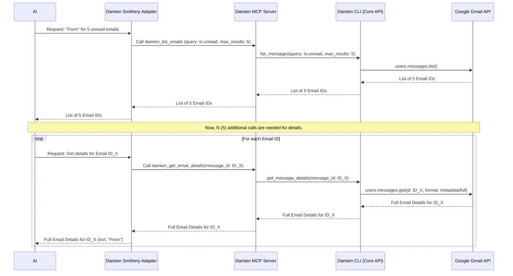
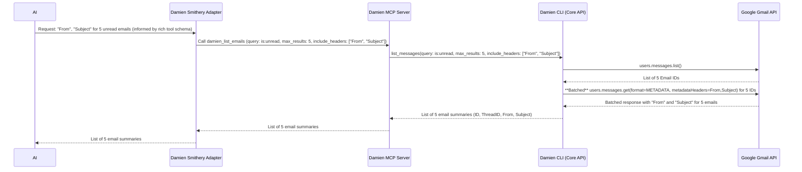

# Damien Email Wrestler: Optimization and Enhancement Plan

## 1. Executive Summary

This document outlines a strategic plan to evolve the Damien Email Wrestler application from its current functional state into a world-class, highly performant, efficient, and practical solution. The core objective is to significantly enhance the application's usability, particularly for AI-driven interactions, by addressing key architectural and implementation areas.

The guiding principle for this enhancement is **Data Transfer Optimization and Granular Control**. This means ensuring that all tools and API interactions are designed to request and return only the necessary data, thereby minimizing AI token usage, reducing latency, and improving overall system responsiveness. A critical component of this is empowering the AI with comprehensive knowledge of available data filtering options through **exceptionally rich and descriptive tool schemas**.

The plan is based on a thorough review of the existing three-tier architecture:
*   **`damien-cli`**: The Python-based core logic engine.
*   **`damien-mcp-server`**: The Python FastAPI server exposing CLI functionalities via the Model Context Protocol (MCP).
*   **`damien-smithery-adapter`**: The Node.js/TypeScript proxy enabling AI assistant integration via the Smithery ecosystem.

Key findings indicate a solid foundation but also critical opportunities for optimization, most notably in how data is fetched from the Gmail API and propagated to the AI. The N+1 query problem identified in fetching email list details is a prime example that will be addressed with high priority. A detailed, upfront testing strategy will be integral to validating these optimizations at each stage.

This plan proposes a phased approach to implement these improvements, ensuring that each phase delivers tangible benefits and maintains application stability. The ultimate goal is to create an application that is not only powerful in its capabilities but also exceptionally efficient, practical, and intelligently usable for its users and integrated AI systems.

## 2. Core Problem Analysis: Data Fetching Inefficiency and Token Usage

A primary challenge impacting the practicality and efficiency of Damien Email Wrestler, especially for AI-driven use cases, is the current strategy for data fetching from the Gmail API.

**The N+1 Query Problem with `damien_list_emails`:**
As highlighted by the user, a simple request like "fetch me the from email addresses of the latest 5 unread emails" currently results in an inefficient sequence of API calls:
1.  One call to `damien_list_emails` (which internally calls Gmail's `users.messages.list`) to retrieve a list of email summaries, primarily containing only `id` and `thread_id`.
2.  For *each* email ID returned, a separate call to `damien_get_email_details` (which internally calls Gmail's `users.messages.get`) is required to fetch the metadata containing the "From" address.

For 5 emails, this translates to 1 (list) + 5 (get details) = 6 calls to the Damien MCP Server, and subsequently a similar number of calls (or one list and 5 individual gets) to the Gmail API.

**Generalization of the Problem:**
This inefficiency is not necessarily isolated to `damien_list_emails`. The core issue is a lack of **granular control over data fetching**. Many tools may default to returning extensive payloads when only a small subset of information is required by the AI.

**Impact:**
*   **Increased AI Token Consumption:** Processing large, verbose JSON payloads (like full email metadata when only a sender is needed) significantly increases the number of tokens the AI needs to handle. This directly translates to higher operational costs and can hit AI model context limits faster.
*   **Higher Latency:** Multiple API round trips increase the overall time taken to fulfill a user's request.
*   **Reduced API Quota Efficiency:** More calls to the Gmail API are made than strictly necessary, potentially hitting rate limits sooner.
*   **Diminished Practicality:** The application feels slow and costly to use, hindering adoption.

Addressing this by enabling fine-grained data requests is paramount for transforming Damien into a "world-class" application.

## 3. Guiding Principles for Enhancement

The following principles will guide all proposed enhancements, ensuring alignment with best-in-class architectural and implementation practices:

1.  **Data Minimization by Default:** Tools should, by default, return the leanest, most commonly useful set of information. Extensive data should be opt-in.
2.  **Caller-Specified Data Granularity:** All tools, especially those fetching lists or detailed objects, must provide parameters allowing the caller (e.g., the AI via the MCP tool schema) to specify precisely which data fields or headers are required.
3.  **API Efficiency:**
    *   Maximize the use of server-side filtering capabilities provided by the Gmail API.
    *   Employ batch operations for multiple Gmail API calls wherever feasible to reduce HTTP overhead and improve throughput.
4.  **Maintainability and Extensibility:** Solutions should be well-structured, clearly documented, easily testable, and designed to accommodate future enhancements without significant refactoring. Adherence to SOLID principles.
5.  **Exceptionally Rich and Descriptive Tool Schemas (High Priority):** Tool definitions exposed to the AI (via the MCP server and Smithery adapter) must be precise, comprehensive, and clearly document all options for granular data requests. This is fundamental to empowering the AI to make efficient calls.
6.  **Robust Error Handling:** Maintain and enhance comprehensive error handling to provide clear, actionable feedback to the caller.
7.  **Comprehensive and Early Testing:** Implement a detailed testing strategy encompassing unit, integration, and end-to-end tests, planned upfront and executed iteratively as development progresses.

## 4. Detailed Analysis and Recommendations by Component & Tool

This section details specific findings and actionable recommendations for each component, with a strong emphasis on the data optimization principle and rich schema provision.

### 4.1. Component: `damien-cli` (Core Logic Engine)

The `damien-cli` is the heart of the application, containing the core email processing logic. Optimizations here will have a cascading positive effect.

#### 4.1.1. Tool: `damien_list_emails` (via `damien_cli.core_api.gmail_api_service.list_messages`)

*   **Issue:** As detailed in Section 2, this tool currently returns only email IDs and thread IDs, necessitating N+1 follow-up calls for any other piece of information.
*   **Solution: Implement Granular Header Fetching**
    1.  **Modify `damien_cli.core_api.gmail_api_service.list_messages` function:**
        *   Change its signature to accept a new optional parameter: `include_headers: Optional[List[str]] = None`.
        *   If `include_headers` is provided and contains valid header names (e.g., "From", "To", "Subject", "Date", "Reply-To"):
            *   The function will first call the existing Gmail `users.messages.list` to get the list of message IDs.
            *   Then, it will use a **new internal batch processing function** (e.g., `_batch_get_messages_metadata`) within `gmail_api_service.py`. This function will:
                *   Construct a single Gmail API batch HTTP request.
                *   Each part of this batch request will target `users.messages.get` for one message ID, using `format='METADATA'` and dynamically setting the `metadataHeaders` query parameter to the comma-separated list of headers specified in `include_headers`.
                *   Example Gmail API call within the batch: `GET /gmail/v1/users/me/messages/{message_id}?format=METADATA&metadataHeaders=From,Subject,Date`
            *   Parse the batch response, extracting only the requested headers for each message.
            *   The `list_messages` function will then return a list of email summaries, where each summary includes the `id`, `thread_id`, and the requested header values.
        *   If `include_headers` is `None` or empty, the function can either return only `id` and `thread_id` (current behavior) or a predefined minimal set (e.g., `id`, `thread_id`, `snippet`). This default behavior should be clearly documented in the tool schema.
    2.  **Update `damien_cli.features.email_management.commands.list_emails_command` (if applicable):** Ensure the CLI command itself can pass through this new option if direct CLI usage needs this feature.
*   **Impact:**
    *   Drastically reduces API calls for common "list and show specific fields" tasks from N+1 to 2 (1 for list, 1 for batched metadata).
    *   Significantly cuts down on data transferred from Gmail and subsequently to the AI, leading to major token savings.
    *   Improves latency.
*   **Architectural Consideration:** This maintains a clean separation, with `gmail_api_service.py` handling the Gmail-specific batching logic. The schema for this tool must meticulously detail the `include_headers` parameter, its benefits, and the list of commonly supported headers.

#### 4.1.2. Tool: `damien_get_email_details` (via `damien_cli.core_api.gmail_api_service.get_message_details`)

*   **Issue:** Even when `format='metadata'` is used, it returns *all* metadata headers, which can be verbose if only one or two specific headers are needed for a single email.
*   **Solution: Support Specific Header Requests for Single Emails**
    1.  **Modify `damien_cli.core_api.gmail_api_service.get_message_details` function:**
        *   Add an optional parameter: `include_headers: Optional[List[str]] = None`.
        *   If `include_headers` is provided and `format_option` (existing parameter) is 'metadata' or 'full' (or if `format_option` is automatically set to 'metadata' when `include_headers` is present):
            *   The function will call Gmail's `users.messages.get` with `format='METADATA'` and the `metadataHeaders` query parameter set to the requested headers.
        *   If `include_headers` is not provided, the function behaves as it currently does with the `format_option`.
    2.  The tool schema must detail this `include_headers` option.
*   **Impact:** Allows for fetching only essential header information for a single email, reducing payload size and token usage when full metadata is not required.

#### 4.1.3. Service: `damien_cli.core_api.rules_api_service.py`

*   **Review Point 1: Optimizing `translate_rule_to_gmail_query`**
    *   **Current:** Translates conditions for "from", "to", "subject", "label".
    *   **Recommendation:** Expand its capabilities to translate more conditions into efficient Gmail server-side queries. This reduces the number of emails that need to be fetched and processed client-side.
        *   Date/age conditions (e.g., `older_than:7d`, `newer_than:7d`). This requires parsing date values in `ConditionModel`.
        *   Attachment conditions (e.g., `has:attachment`, `filename:pdf`).
        *   Message size conditions (e.g., `larger:1M`, `smaller:100K`).
    *   **Impact:** Improved performance for rule application by leveraging more of Gmail's native filtering.
*   **Review Point 2: Data returned by `apply_rules_to_mailbox`**
    *   **Current:** The `summary_dict` can be extensive, listing all affected email IDs for each action.
    *   **Recommendation:**
        *   By default, return a more concise summary (e.g., counts of emails affected per action, total scanned, total matched).
        *   Introduce a parameter (e.g., `include_detailed_ids: bool = False`) to the `damien_apply_rules` tool (and underlying service) to allow the AI to request the full list of affected email IDs if needed. The schema must clearly explain this.
    *   **Impact:** Reduced data payload for typical rule application feedback, saving tokens.
*   **Review Point 3: `transform_gmail_message_to_matchable_data`**
    *   **Current:** Fetches label names using `get_label_name_from_id`.
    *   **Recommendation:** If the `damien_list_emails` tool (when applying rules) can provide richer summaries (including resolved label names due to Recommendation 4.1.1), this function might be simplified or might need to handle already resolved label names, potentially avoiding redundant `get_label_name_from_id` calls if the label cache in `gmail_api_service` was already populated by the initial fetch.

#### 4.1.4. Other `damien-cli` Considerations

*   **Performance:**
    *   Label Caching (`gmail_api_service._label_name_to_id_cache`): The current "refresh on miss" is generally good. For extreme scale, a TTL could be considered, but this is low priority.
*   **Pragmatism & Extensibility:**
    *   `ConditionModel` fields: Consider expanding with `cc`, `bcc`, `has_attachment`, `attachment_filename_contains`, `message_size`, `is_reply`, `is_forward`. Each requires logic in `_email_field_matches_condition` and potential `translate_rule_to_gmail_query` updates. The tool schemas must reflect any new fields as filterable options.
    *   Rule Storage (`rules.json`): For future scalability (thousands of rules), SQLite could be an option. Not an immediate priority.
*   **Security:** No specific concerns noted from the code read, but general best practices (input validation, secure file handling) should always be maintained.

### 4.2. Component: `damien-mcp-server`

This component acts as the crucial bridge exposing `damien-cli`'s power via MCP.

#### 4.2.1. `DamienAdapter` and Tool Exposure (High Priority for AI Empowerment)

*   **Issue:** The schemas for tools exposed via `/mcp/list_tools` must be exceptionally rich and accurately reflect all new parameters for granular data control (e.g., `include_headers` for `damien_list_emails`, listing allowed header names, explaining benefits).
*   **Solution:**
    1.  Ensure `DamienAdapter` methods (e.g., `list_emails_tool`, `get_email_details_tool`) are updated to accept and pass through the new parameters (like `include_headers`) to the `damien-cli` services.
    2.  The Pydantic models used for request body validation in the `tools_router.py` for these endpoints must be updated to include these new optional parameters.
    3.  **Critically, the `/mcp/list_tools` endpoint must dynamically generate comprehensive and accurate JSON Schemas for the input and output of each tool.** This includes:
        *   Detailed descriptions for each parameter, especially new ones like `include_headers`.
        *   For `include_headers`, the description must list common and recommended header names that can be requested (e.g., "From", "To", "Subject", "Date", "Reply-To", "Message-ID", "Cc", "Bcc").
        *   The description should also explain *why* using such parameters is beneficial (e.g., "Reduces data transfer and token usage by fetching only specified headers.").
        *   Clearly define `enum` values if a parameter has a fixed set of options.
*   **Impact:** Enables the AI to fully understand and utilize the new granular data fetching capabilities, making intelligent and efficient tool calls. This is fundamental to the project's success.

#### 4.2.2. Session Management (DynamoDB)

*   **Review Point:** Efficiency and cost of DynamoDB.
*   **Recommendation:**
    *   Confirm that the key structure (`user_id`, `session_id`) is optimal for query patterns.
    *   Ensure session data stored is minimized to what's essential for maintaining conversation context. Avoid storing large, redundant data blobs in the session.
    *   Verify TTL is appropriately configured to manage costs.
*   **Impact:** Optimized performance and cost for stateful AI interactions.

#### 4.2.3. Other `damien-mcp-server` Considerations

*   **Error Propagation:** Ensure errors from `damien-cli` (especially new validation errors related to `include_headers` content or invalid header names) are clearly propagated as structured MCP error responses. The error messages should be informative for the AI.

### 4.3. Component: `damien-smithery-adapter`

This adapter makes Damien's tools available to Smithery-compatible AIs.

#### 4.3.1. Tool Schema Consumption

*   **Issue:** The adapter currently has a static fallback for tool definitions (`toolSchemas.ts`). While pragmatic, it can become outdated and will not reflect the new dynamic, rich schemas.
*   **Solution:**
    1.  **Prioritize dynamic fetching of tool definitions** from a robust and schema-rich `/mcp/list_tools` endpoint on the `damien-mcp-server`.
    2.  Ensure the adapter correctly parses and utilizes the full, detailed schemas provided by the MCP server, especially for new parameters like `include_headers` and their detailed descriptions.
    3.  The static fallback in `toolSchemas.ts` should be significantly reduced in importance or removed if the dynamic fetching is made highly reliable. If kept, it must be updated but acknowledged as a limited representation.
*   **Impact:** Ensures the AI (via Smithery) always has the most up-to-date and comprehensive understanding of tool capabilities.

#### 4.3.2. `DamienApiClient.ts`

*   **Recommendation (Minor):** Add configurable timeouts for HTTP requests made to the `damien-mcp-server` to prevent indefinite hangs if the MCP server is slow to respond.
*   Ensure it correctly serializes new optional parameters (like `include_headers`) in the `input` object when calling the MCP server's `/mcp/execute_tool`.

## 5. Detailed Testing Strategy

An upfront, detailed testing strategy is essential for validating optimizations and ensuring application stability throughout the phased development.

**General Testing Principles:**
*   **Test Pyramid Adherence:** Focus on a broad base of unit tests, a moderate number of integration tests, and a smaller, targeted set of E2E tests.
*   **Full Automation:** All tests should be automated and integrated into a CI/CD pipeline if available.
*   **Isolation for Unit Tests:** Unit tests must mock dependencies to test components in isolation.
*   **Realism in Integration/E2E Tests:** Use real or high-fidelity mocks for dependencies. For Gmail API interactions, this might involve a dedicated test Gmail account or a sophisticated mock that can validate call patterns (e.g., batching, `metadataHeaders` usage).
*   **High Code Coverage:** Strive for extensive code coverage, especially for critical paths and new logic in `damien-cli`.
*   **Data-Driven Approach:** Utilize diverse test data for rule matching, email structures, and header combinations.

**Testing Strategy per Phase (Illustrative for Phase 1):**

*   **Phase 1 Objective:** Optimize `damien_list_emails` & `damien_get_email_details` for granular data fetching.
    *   **`damien-cli` (`gmail_api_service.py`):**
        *   **Unit Tests:**
            *   `_batch_get_messages_metadata`: Test correct batch request construction (various IDs, headers), mock Gmail API response, verify parsing, test edge cases (empty IDs/headers, invalid headers).
            *   `list_messages`: Test `include_headers` (null, empty, populated), correct calls to batching, result merging, pagination with new params.
            *   `get_message_details`: Test `include_headers`, correct Gmail API call (`format=METADATA`, `metadataHeaders`), fallback to existing `format_option`.
    *   **`damien-mcp-server` (`DamienAdapter.py`, `tools_router.py`):**
        *   **Integration Tests (FastAPI app, mocking `damien-cli`):**
            *   `/mcp/execute_tool` for `damien_list_emails` & `damien_get_email_details`: Test with various `include_headers` values, mock `DamienAdapter` responses, verify HTTP response correctness, Pydantic validation of new params.
            *   `/mcp/list_tools`: **Critically verify** that the generated JSON schema for affected tools is rich, accurate, and details `include_headers`, its purpose, and allowed values.
    *   **`damien-smithery-adapter`:**
        *   **Integration Tests (Adapter, mocking `damien-mcp-server`):**
            *   Adapter's `/execute`: Simulate AI calls with `include_headers`, mock `DamienApiClient.executeTool`, verify request/response forwarding.
            *   `toolSchemas.ts` (`getDamienToolDefinitions`): Mock `DamienApiClient.listTools` with updated rich schemas, verify correct parsing.
    *   **End-to-End (E2E) Tests:**
        *   **Scenario 1 (Happy Path):** Test Gmail account -> AI call via Smithery Adapter for `damien_list_emails` with specific `include_headers` -> Assert final response contains *only* requested headers + ID/threadId. Verify (via logs/mocks) optimized Gmail API call pattern (1 list + 1 batched get with correct `metadataHeaders`).
        *   **Scenario 2 (Edge Cases):** Empty `include_headers`, invalid header names, header not present on some emails.
        *   These E2E tests run against all three services. Gmail API interaction requires a test account or a sophisticated mock.

This detailed testing approach will be adapted and applied to each subsequent development phase.

## 6. Cross-Cutting Concerns

These apply across all components:

*   **Configuration Management:**
    *   Ensure paths to `credentials.json` and `token.json` are robustly handled.
    *   New features/parameters should be configurable if they have system-wide implications (e.g., default headers to fetch if `include_headers` is not specified by AI).
*   **Logging and Monitoring:**
    *   **Recommendation:** Standardize log formats (e.g., JSON) and key log event types across all three components. This aids in debugging and monitoring.
    *   Add specific logs to track the usage of granular fetching features (e.g., which headers were requested, payload sizes before/after optimization).
*   **Documentation:**
    *   **Recommendation (High Priority):**
        *   Update all `README.md` files and architectural documents (`ARCHITECTURE.md` for CLI, MCP Server) to reflect the new data fetching strategies and tool parameters.
        *   Ensure comprehensive docstrings for all public functions/methods, especially those in `core_api` and `DamienAdapter`, detailing new parameters like `include_headers`, their allowed values, benefits, and behavior.
        *   The output of `/mcp/list_tools` (the JSON schemas) is critical documentation for the AI and must be treated as such.

## 7. Phased Implementation Roadmap

This roadmap breaks down the work into logical, manageable phases, prioritizing the most impactful changes first.

### Phase 1: Core Data Retrieval Optimization (Highest Priority)

*   **Objective:** Solve the primary pain point of `damien_list_emails` and `damien_get_email_details` by implementing granular, efficient metadata fetching.
*   **Key Tasks:**
    1.  **`damien-cli` (`gmail_api_service.py`):**
        *   Implement internal `_batch_get_messages_metadata` function using Gmail API batch requests with `format=METADATA` and specified `metadataHeaders`.
        *   Modify `list_messages` to accept `include_headers: Optional[List[str]]` and use the batch function.
        *   Modify `get_message_details` to accept `include_headers: Optional[List[str]]` and use `metadataHeaders` for single gets.
    2.  **`damien-mcp-server` (`DamienAdapter.py`, `tools_router.py`, Pydantic models):**
        *   Update `list_emails_tool` and `get_email_details_tool` methods in `DamienAdapter` to accept and pass through `include_headers`.
        *   Update corresponding Pydantic request models in the router to include the new optional `include_headers` parameter.
        *   **Crucially, ensure the `/mcp/list_tools` endpoint dynamically generates updated and exceptionally rich JSON Schemas for these tools, clearly documenting `include_headers`, its purpose, benefits, and a comprehensive list of recommended/allowed header names.**
    3.  **`damien-smithery-adapter` (`damienApiClient.ts`, `toolSchemas.ts`):**
        *   Ensure `DamienApiClient` can correctly pass the `include_headers` parameter in the `input` object when calling the MCP server's `/mcp/execute_tool`.
        *   Prioritize dynamic fetching in `getDamienToolDefinitions` to consume the rich schemas from the MCP server.
    4.  **Testing:** Implement the detailed testing strategy outlined in Section 5 for Phase 1.
*   **Deliverable:** A significantly more token-efficient and practical way for the AI to list emails and get email details with only the necessary header information, guided by rich tool schemas. This forms the foundation for a "world-class" practical application.

### Phase 2: Rule Engine Enhancements & Broader Tool Optimization

*   **Objective:** Improve the performance of rule processing and apply data optimization principles to other tools, always ensuring rich schema descriptions.
*   **Key Tasks:**
    1.  **`damien-cli` (`rules_api_service.py`):**
        *   Enhance `translate_rule_to_gmail_query` to support more conditions (dates, attachments, size).
        *   Review and implement options for concise vs. detailed summaries from `apply_rules_to_mailbox` (e.g., `include_detailed_ids` parameter, clearly documented in schema).
    2.  **Tool Review (`damien_list_rules`, etc.):**
        *   Analyze `damien_list_rules`: If many rules exist, consider if a summary view (names/IDs only) with a separate `damien_get_rule_details(rule_id)` tool would be more efficient. Schema must be clear.
        *   Systematically review all other MCP tools for similar data optimization opportunities (lean default responses, parameters for granularity, rich schema descriptions).
    3.  **Update MCP Server & Smithery Adapter:** Propagate any schema changes from these tool optimizations, ensuring descriptions are thorough.
    4.  **Testing:** Add tests for new rule translation capabilities and optimized tool behaviors.
*   **Deliverable:** More efficient server-side rule filtering, and leaner, more controllable data payloads from a wider range of tools, all clearly exposed to the AI.

### Phase 3: Advanced Optimizations, Scalability, and Polish

*   **Objective:** Address longer-term scalability, developer experience, and advanced features.
*   **Key Tasks:**
    1.  **Logging:** Implement standardized, structured logging across all components.
    2.  **`damien-mcp-server`:** Review DynamoDB performance and cost-efficiency with current/projected load.
    3.  **`damien-cli`:** If rule sets are anticipated to become extremely large, evaluate and potentially implement SQLite for rule storage.
    4.  **Documentation:** Finalize all code docstrings, update `ARCHITECTURE.md` files, and ensure comprehensive user/developer documentation for all features, especially new granular controls and their schema representations.
*   **Deliverable:** A highly polished, observable, robust, and well-documented system prepared for future growth and complex use cases.

## 8. Empowering the AI with Rich Tool Schemas (High Priority)

Successfully implementing these technical changes is only part of the solution. The AI interacting with Damien must be able to fully leverage these new capabilities. This is achieved primarily through the quality of the tool schemas.

*   **Exceptionally Rich and Descriptive JSON Schemas:** This is a **top priority**. The schemas provided by the `damien-mcp-server`'s `/mcp/list_tools` endpoint are the AI's primary way of understanding how to use the tools efficiently.
    *   **Parameter Descriptions:** Each parameter, especially new ones like `include_headers`, must have a detailed description explaining:
        *   Its purpose (e.g., "Specifies a list of email header names to retrieve. Using this parameter significantly reduces data transfer and AI token processing by fetching only the requested information.").
        *   Its data type and format.
        *   **Allowed/Recommended Values:** For `include_headers`, explicitly list common and effective header names (e.g., `'From', 'To', 'Cc', 'Bcc', 'Subject', 'Date', 'Reply-To', 'Message-ID'`).
        *   Default behavior if the parameter is omitted.
    *   **Tool Descriptions:** The overall tool description should also hint at optimization capabilities.
*   **AI Orchestrator Consumption:** AI orchestrators are designed to fetch and parse these `/tools` schemas. The richer the schema, the better the AI can:
    *   Understand the precise capabilities of each tool.
    *   Identify optional parameters that can lead to more efficient execution.
    *   Construct optimal tool calls based on user intent and its knowledge of the tool's parameters.
*   **AI Prompting (Secondary Reinforcement):**
    *   If direct prompting of an LLM is involved in deciding tool calls, the system prompt can be augmented with guidance: "When using Damien email tools, always try to be specific about the data you need. For example, if listing emails, use the 'include_headers' parameter to request only the sender or subject if that's all you require. This improves speed and efficiency. Consult the tool's schema for available headers."
*   **Developer Documentation:** For any human developers integrating with Damien's MCP API, clear documentation (separate from or augmenting the schemas) on these optimization parameters and best practices for their use is essential.

By prioritizing the richness and clarity of the tool schemas, we directly empower the AI to use Damien in the most performant and token-efficient manner possible.

## 9. Conclusion

The Damien Email Wrestler application possesses a strong architectural foundation. By systematically addressing data fetching strategies, embracing the principle of granular control, and prioritizing the delivery of rich, descriptive tool schemas to the AI, we can transform it into an exceptionally performant, efficient, and practical tool. The phased implementation plan outlined above focuses on delivering the most critical user-facing and AI-enabling improvements first, while establishing a clear path for ongoing enhancement. This comprehensive approach will be instrumental in achieving the vision of a world-class, AI-powered email management champion that is both powerful and economical to operate.