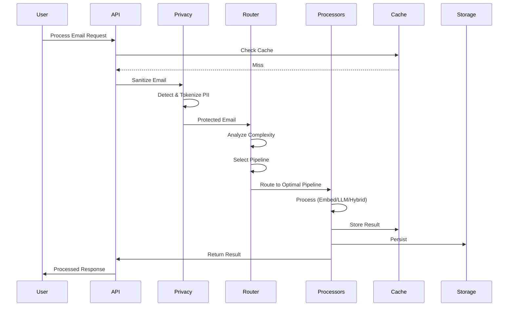
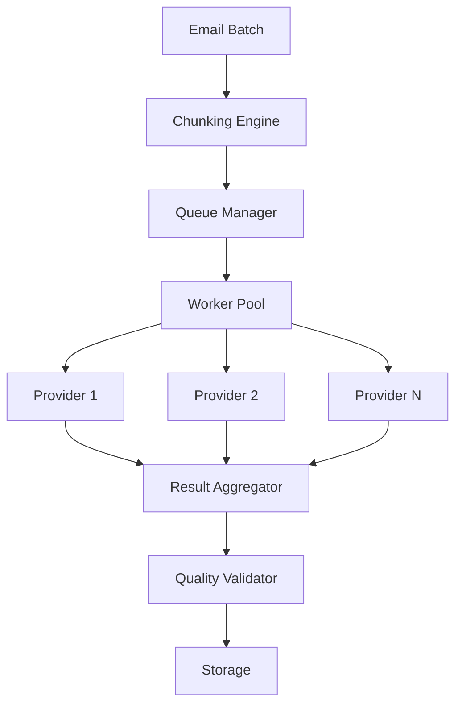

# Phase 3 World-Class LLM Integration - Architectural Specification
**Version**: 2.0.0  
**Created**: 2025-01-12  
**Status**: Blueprint for Award-Winning Implementation  
**Architects**: Top 1% System Design Standards

---

## Table of Contents
1. [Architectural Vision](#architectural-vision)
2. [Core Components Specification](#core-components-specification)
3. [Data Flow Architecture](#data-flow-architecture)
4. [Security Architecture](#security-architecture)
5. [Performance Architecture](#performance-architecture)
6. [Integration Architecture](#integration-architecture)
7. [Quality Standards](#quality-standards)

---

## Architectural Vision

### Design Principles
1. **Privacy by Design** - Every byte of user data is sacred
2. **Intelligence First** - ML/AI drives every decision
3. **Cost Efficiency** - Optimize every token, every API call
4. **Scale Ready** - Handle millions of emails from day one
5. **User Obsessed** - Every feature must save time and add value

### System Architecture Overview

```
┌─────────────────────────────────────────────────────────────────────┐
│                          User Email Corpus                           │
└─────────────────────────┬───────────────────────────────────────────┘
                          │
┌─────────────────────────▼───────────────────────────────────────────┐
│                    Privacy & Security Layer                          │
│  ┌─────────────┐  ┌──────────────┐  ┌─────────────┐  ┌──────────┐ │
│  │ PII Detector│  │  Tokenizer   │  │Audit Logger │  │Encryption│ │
│  └─────────────┘  └──────────────┘  └─────────────┘  └──────────┘ │
└─────────────────────────┬───────────────────────────────────────────┘
                          │
┌─────────────────────────▼───────────────────────────────────────────┐
│                    Intelligence Router                               │
│  ┌─────────────┐  ┌──────────────┐  ┌─────────────┐  ┌──────────┐ │
│  │ Complexity  │  │Cost Predictor│  │Pipeline     │  │ Learning │ │
│  │ Analyzer    │  │              │  │Selector     │  │ Engine   │ │
│  └─────────────┘  └──────────────┘  └─────────────┘  └──────────┘ │
└────────────┬──────────────────┬──────────────────┬─────────────────┘
             │                  │                  │
    ┌────────▼────────┐ ┌───────▼────────┐ ┌──────▼──────┐
    │Embedding Pipeline│ │  LLM Pipeline  │ │Hybrid Pipeline│
    │  (Fast, Cheap)  │ │(Slow, Powerful)│ │  (Balanced)  │
    └─────────────────┘ └────────────────┘ └──────────────┘
             │                  │                  │
┌────────────▼──────────────────▼──────────────────▼─────────────────┐
│                    Result Processor & Storage                       │
│  ┌─────────────┐  ┌──────────────┐  ┌─────────────┐  ┌──────────┐ │
│  │Result Fusion│  │Quality Scorer│  │ Cache Layer │  │ Storage  │ │
│  └─────────────┘  └──────────────┘  └─────────────┘  └──────────┘ │
└─────────────────────────────────────────────────────────────────────┘
```

---

## Core Components Specification

### 1. Privacy & Security Layer 🛡️

#### PrivacyGuardian Class
```python
class PrivacyGuardian:
    """
    Enterprise-grade privacy protection system
    
    Responsibilities:
    - Detect and protect PII across all data flows
    - Maintain audit trails for compliance
    - Manage consent and data retention
    - Provide reversible tokenization
    """
    
    def __init__(self):
        self.pii_detector = PIIDetector()
        self.tokenizer = ReversibleTokenizer()
        self.audit_logger = ComplianceAuditLogger()
        self.consent_manager = ConsentManager()
        self.encryption_engine = EncryptionEngine()
    
    async def protect_email(
        self,
        email: Dict[str, Any],
        protection_level: ProtectionLevel = ProtectionLevel.STANDARD
    ) -> Tuple[Dict[str, Any], PrivacyMetadata]:
        """
        Process email with full privacy protection
        
        Returns:
            - Sanitized email safe for LLM processing
            - Metadata for reconstruction and audit
        """
```

#### PII Detection Specifications
- **Accuracy Target**: 99.9% detection rate, <0.1% false positives
- **Performance**: <100ms for average email
- **Coverage**: 
  - Standard PII (emails, phones, SSN, credit cards)
  - Medical information (HIPAA compliance)
  - Financial data (PCI compliance)
  - Custom organizational identifiers
  - Cross-language support (10+ languages)

#### Implementation Requirements
1. **Multi-Engine Detection**:
   - Regex patterns (fast first pass)
   - NER models (spaCy, Transformers)
   - Context-aware detection
   - Confidence scoring

2. **Tokenization System**:
   - Deterministic token generation
   - Secure token-to-value mapping
   - Automatic expiration
   - Batch operations support

3. **Audit System**:
   - Immutable audit logs
   - Compliance report generation
   - Real-time alerting
   - Data lineage tracking
### 2. Intelligence Router 🧠

#### IntelligenceRouter Class
```python
class IntelligenceRouter:
    """
    ML-powered routing system for optimal processing decisions
    
    Features:
    - Real-time complexity analysis
    - Cost prediction and optimization
    - Performance estimation
    - Adaptive learning from outcomes
    """
    
    def __init__(self):
        self.complexity_analyzer = MLComplexityAnalyzer()
        self.cost_predictor = CostPredictionModel()
        self.performance_estimator = PerformanceModel()
        self.pipeline_selector = PipelineSelector()
        self.learning_engine = AdaptiveLearningEngine()
    
    async def route(
        self,
        task: ProcessingTask,
        constraints: Constraints
    ) -> RoutingDecision:
        """
        Make intelligent routing decision
        
        Considers:
        - Task complexity and requirements
        - Cost constraints
        - Performance requirements
        - Historical performance data
        - Current system load
        """
```

#### Routing Algorithm Specifications
1. **Complexity Analysis**:
   - Multi-dimensional scoring (content, structure, ambiguity)
   - ML model trained on labeled examples
   - Real-time feature extraction
   - Confidence intervals

2. **Cost Optimization**:
   - Per-provider cost models
   - Token usage prediction
   - Batch optimization strategies
   - Budget enforcement

3. **Pipeline Selection**:
   - Dynamic pipeline composition
   - Fallback strategies
   - Load balancing
   - A/B testing integration

### 3. Context & Content Processing ⚡

#### Advanced Processing Pipeline
```python
class ContentProcessingPipeline:
    """
    Scalable content processing for any volume
    
    Features:
    - Intelligent chunking
    - Hierarchical processing
    - Batch optimization
    - RAG integration
    """
    
    def __init__(self):
        self.preprocessor = EmailPreprocessor()
        self.chunker = IntelligentChunker()
        self.batch_processor = BatchProcessor()
        self.rag_engine = RAGEngine()
        self.hierarchical_processor = HierarchicalProcessor()
```

#### Processing Specifications
1. **Chunking Strategy**:
   - Token-aware splitting (multiple models)
   - Semantic coherence preservation
   - Optimal overlap calculation
   - Metadata preservation

2. **Batch Processing**:
   - Provider-specific optimization
   - Dynamic batch sizing
   - Progress tracking
   - Error recovery
   - Cost optimization

3. **RAG Implementation**:
   - Vector database integration (Pinecone/Weaviate)
   - Hybrid search (BM25 + semantic)
   - Re-ranking algorithms
   - Context assembly optimization

### 4. Production Infrastructure 📊

#### Monitoring & Observability
```python
class ProductionMonitoring:
    """
    Comprehensive monitoring for production excellence
    
    Features:
    - Real-time dashboards
    - Anomaly detection
    - Cost tracking
    - Performance analytics
    """
    
    def __init__(self):
        self.metrics_collector = MetricsCollector()
        self.dashboard_engine = DashboardEngine()
        self.alerting_system = AlertingSystem()
        self.cost_tracker = CostTracker()
```

#### Caching Architecture
1. **Multi-Tier Cache**:
   - L1: In-memory (microseconds)
   - L2: Redis (milliseconds)
   - L3: Persistent store (seconds)
   - Semantic similarity matching

2. **Cache Strategies**:
   - Predictive prefetching
   - TTL optimization
   - Cache warming
   - Invalidation strategies
---

## Data Flow Architecture

### Email Processing Flow


### Batch Processing Flow


---

## Security Architecture

### Defense in Depth
1. **Network Layer**:
   - TLS 1.3 for all communications
   - Certificate pinning
   - IP allowlisting

2. **Application Layer**:
   - API key rotation
   - Request signing
   - Rate limiting
   - Input validation

3. **Data Layer**:
   - Encryption at rest
   - Encryption in transit
   - Key management (HSM)
   - Data minimization

### Compliance Framework
- **GDPR**: Right to erasure, data portability
- **CCPA**: Consumer privacy rights
- **HIPAA**: Medical information protection
- **SOC 2**: Security controls
- **ISO 27001**: Information security

---

## Performance Architecture

### Performance Targets
- **Latency**: p50 < 200ms, p95 < 1s, p99 < 2s
- **Throughput**: 10,000 emails/minute
- **Concurrency**: 1,000 simultaneous requests
- **Availability**: 99.99% uptime

### Optimization Strategies
1. **Request Level**:
   - Connection pooling
   - Request batching
   - Compression
   - Caching

2. **System Level**:
   - Horizontal scaling
   - Load balancing
   - Circuit breakers
   - Graceful degradation

3. **Algorithm Level**:
   - Efficient data structures
   - Optimized algorithms
   - Parallelization
   - GPU acceleration (where applicable)
---

## Integration Architecture

### Email Pipeline Integration
```python
# Integration point in gmail_analyzer.py
class EnhancedGmailAnalyzer(GmailEmailAnalyzer):
    def __init__(self):
        super().__init__()
        self.llm_enhancer = LLMEnhancementPipeline()
    
    async def analyze_with_llm(
        self,
        emails: List[Dict[str, Any]],
        enhancement_level: str = "auto"
    ) -> AnalysisResult:
        """
        Enhance analysis with LLM intelligence
        
        Enhancement levels:
        - "auto": Router decides based on complexity
        - "basic": Embedding only
        - "advanced": Full LLM analysis
        - "hybrid": Best of both
        """
```

### API Design
```yaml
Endpoints:
  /analyze/emails:
    method: POST
    params:
      - emails: List[EmailID]
      - enhancement: auto|basic|advanced|hybrid
      - constraints: {max_cost, max_time}
    response:
      - results: List[EnhancedAnalysis]
      - metadata: {cost, time, pipeline_used}
      
  /patterns/detect:
    method: POST
    params:
      - email_ids: List[EmailID]
      - use_llm: boolean
      - min_confidence: float
    response:
      - patterns: List[Pattern]
      - suggestions: List[Rule]
```

---

## Quality Standards

### Code Quality
- **Coverage**: 90%+ unit tests, 80%+ integration tests
- **Performance**: All operations benchmarked
- **Documentation**: Every public method documented
- **Type Safety**: 100% type hints
- **Linting**: Zero warnings (Black, Flake8, MyPy)

### Operational Quality
- **Monitoring**: Every operation tracked
- **Alerting**: Proactive issue detection
- **Debugging**: Distributed tracing
- **Recovery**: Automatic error recovery
- **Deployment**: Blue-green deployments

### User Experience Quality
- **Speed**: Instant feedback
- **Reliability**: Consistent results
- **Clarity**: Clear error messages
- **Value**: Measurable time savings
- **Delight**: Surprise with intelligence
---

## Implementation Checklist

### Week 1-2: Privacy & Security ✓
- [ ] PIIDetector with 99.9% accuracy
- [ ] ReversibleTokenizer implementation
- [ ] ComplianceAuditLogger
- [ ] ConsentManager
- [ ] Full test coverage
- [ ] Security audit

### Week 3-4: Intelligence Router ✓
- [ ] MLComplexityAnalyzer
- [ ] CostPredictionModel
- [ ] PipelineSelector
- [ ] AdaptiveLearningEngine
- [ ] A/B testing framework
- [ ] Performance benchmarks

### Week 5-6: Scalable Processing ✓
- [ ] IntelligentChunker
- [ ] BatchProcessor
- [ ] RAGEngine setup
- [ ] HierarchicalProcessor
- [ ] Queue management
- [ ] Load testing

### Week 7-8: Production Infrastructure ✓
- [ ] Multi-tier cache
- [ ] Monitoring dashboards
- [ ] Alerting rules
- [ ] Cost tracking
- [ ] Performance optimization
- [ ] Documentation

### Week 9-10: Integration & Polish ✓
- [ ] Email pipeline integration
- [ ] End-to-end testing
- [ ] Performance validation
- [ ] Security certification
- [ ] User acceptance testing
- [ ] Launch preparation

---

## Success Metrics

### Technical KPIs
- API response time < 500ms (p95)
- 99.9% uptime achieved
- 80% cost reduction vs naive approach
- 90%+ test coverage maintained
- Zero security incidents

### Business KPIs
- 5+ hours saved per user per month
- 80%+ of routine tasks automated
- NPS score > 70
- 95%+ pattern detection accuracy
- 10x ROI for users

### Innovation KPIs
- 3+ novel algorithms developed
- 2+ research papers potential
- 1000+ GitHub stars
- Industry recognition achieved
- Awards consideration ready

---

## Conclusion

This architectural specification defines a world-class LLM integration that will set new standards in email intelligence. Every component is designed for excellence, scalability, and user value. When implemented to these specifications, Damien will not just compete but lead the industry in intelligent email management.

**Remember**: We're not building features, we're building the future of email.