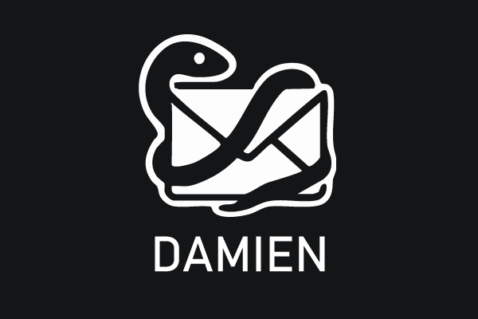

# 🤼‍♂️ Damien Email Wrestler

**The AI-Powered Gmail Management Champion**

Damien Email Wrestler is a comprehensive email management solution that enables AI assistants like Claude to interact with your Gmail account through advanced filtering, organization, and automation capabilities. Built with the Model Context Protocol (MCP) and integrated with the Smithery ecosystem.

## 🚀 What Does Damien Do?

- **Smart Email Filtering**: Create sophisticated rules to automatically organize your inbox
- **AI-Powered Actions**: Let AI assistants manage your emails using natural language
- **Bulk Operations**: Efficiently handle large volumes of emails
- **Advanced Search**: Find emails using complex queries
- **Rule-Based Automation**: Set up automated workflows for email management
- **Safe Operations**: Dry-run mode for testing before making changes

## 🏗️ Architecture

Damien Email Wrestler consists of three integrated components:

```
┌─────────────────┐    ┌─────────────────────┐    ┌──────────────────┐    ┌─────────────┐
│                 │    │                     │    │                  │    │             │
│   AI Assistant  │◄──►│  Smithery Adapter   │◄──►│   Damien MCP     │◄──►│ Gmail API   │
│    (Claude)     │    │   (Port 8081)       │    │   Server         │    │             │
│                 │    │                     │    │   (Port 8892)    │    │             │
└─────────────────┘    └─────────────────────┘    └──────────────────┘    └─────────────┘
                                │                           │
                                │                           │
                                ▼                           ▼
                       ┌─────────────────┐         ┌─────────────────┐
                       │                 │         │                 │
                       │ Smithery        │         │ Damien CLI      │
                       │ Registry        │         │ (Core Logic)    │
                       │                 │         │                 │
                       └─────────────────┘         └─────────────────┘
```

## 📋 Prerequisites

- **Operating System**: macOS, Linux, or Windows with WSL2
- **Python**: 3.13+ with Poetry package manager
- **Node.js**: 18.0+ with npm
- **Docker**: Latest version with Docker Compose
- **Gmail Account**: With API access enabled
- **Google Cloud Project**: For Gmail API credentials

## 🚀 Quick Start

**TL;DR**: Get Damien running in 2 minutes:

```bash
git clone https://github.com/ivan-rivera-projects/Damien-Email-Wrestler.git
cd Damien-Email-Wrestler
./scripts/start-all.sh  # Start all services
./scripts/test.sh       # Run tests
```

**Need help?** Check the [detailed startup guide](scripts/README.md) or follow the options below.

### ⚠️ Important: Service Dependencies

Damien Email Wrestler requires **two services** to be running:
1. **Damien MCP Server** (Port 8892) - Core email management functionality
2. **Smithery Adapter** (Port 8081) - AI assistant integration layer

**Always start both services before running tests or using Damien:**
```bash
# Start all services
./scripts/start-all.sh

# Or manually start each service:
cd damien-mcp-server && poetry run uvicorn app.main:app --port 8892 &
cd damien-smithery-adapter && npm run serve &

# Stop all services when done
./scripts/stop-all.sh
```

### Option 1: One-Command Startup (Recommended)

**Perfect for:** Quick testing, demos, and production deployment

1. **Clone and setup:**
   ```bash
   git clone https://github.com/ivan-rivera-projects/Damien-Email-Wrestler.git
   cd Damien-Email-Wrestler
   
   # Place your credentials.json file here (see Gmail API setup guide)
   # Run the magic startup script
   ./scripts/start.sh
   ```

2. **Test your installation:**
   ```bash
   ./scripts/test.sh
   ```

3. **Connect to Claude Desktop:** Add to your Claude config:
   ```json
   {
     "mcpServers": {
       "damien-email-wrestler": {
         "command": "node",
         "args": ["/path/to/damien-smithery-adapter/dist/index.js"],
         "env": {
           "DAMIEN_MCP_SERVER_URL": "http://localhost:8892",
           "DAMIEN_MCP_SERVER_API_KEY": "your-api-key-here"
         }
       }
     }
   }
   ```

### Option 2: Docker Compose (Manual Setup)

2. **Set up Gmail API credentials:**
   ```bash
   # Follow the setup guide to get credentials.json
   # Place it in the project root directory
   ```

3. **Configure environment variables:**
   ```bash
   cp .env.example .env
   # Edit .env with your specific settings
   ```

4. **Start all services:**
   ```bash
   docker-compose up -d
   ```

5. **Authenticate with Gmail:**
   ```bash
   docker-compose exec damien-cli poetry run damien login
   ```

6. **Test the installation:**
   ```bash
   curl http://localhost:8081/health
   ```

### Option 2: Manual Installation

1. **Clone and navigate:**
   ```bash
   git clone https://github.com/ivan-rivera-projects/Damien-Email-Wrestler.git
   cd Damien-Email-Wrestler
   ```

2. **Set up each component:**
   ```bash
   # Run the automated setup script
   chmod +x scripts/setup.sh
   ./scripts/setup.sh
   ```

3. **Start services individually:**
   ```bash
   # Terminal 1: Start Damien MCP Server
   cd damien-mcp-server
   poetry run uvicorn app.main:app --port 8892

   # Terminal 2: Start Smithery Adapter
   cd damien-smithery-adapter
   npm run serve

   # Terminal 3: Test the system
   cd scripts
   ./test.sh
   ```

## 🔧 Configuration

### Environment Variables

Damien Email Wrestler uses environment variables for configuration. 

To set up your environment:

1. **Copy the example environment file:**
   ```bash
   cp .env.example .env
   ```

2. **Generate a secure API key:**
   ```bash
   # Generate a random 32-byte hex string for your API key
   openssl rand -hex 32
   ```

3. **Edit the `.env` file with your specific settings**

For detailed environment setup instructions, see [Environment Setup Guide](ENV_SETUP.md).

The configuration includes:

### Gmail API Setup

1. **Create a Google Cloud Project:**
   - Go to [Google Cloud Console](https://console.cloud.google.com/)
   - Create a new project or select an existing one

2. **Enable Gmail API:**
   - Navigate to "APIs & Services" > "Library"
   - Search for "Gmail API" and enable it

3. **Create OAuth 2.0 Credentials:**
   - Go to "APIs & Services" > "Credentials"
   - Click "Create Credentials" > "OAuth client ID"
   - Choose "Desktop application"
   - Download the JSON file and rename it to `credentials.json`
   - Place it in the project root directory

## 🎯 Usage Examples

### Basic Email Operations

```bash
# List unread emails
curl -X POST http://localhost:8081/execute \
  -H "Content-Type: application/json" \
  -d '{
    "tool": "damien_list_emails",
    "input": {"query": "is:unread", "max_results": 10}
  }'

# Get email details
curl -X POST http://localhost:8081/execute \
  -H "Content-Type: application/json" \
  -d '{
    "tool": "damien_get_email_details",
    "input": {"message_id": "your-email-id"}
  }'
```

### Rule-Based Email Management

```bash
# Create a rule to archive newsletters
curl -X POST http://localhost:8081/execute \
  -H "Content-Type: application/json" \
  -d '{
    "tool": "damien_add_rule",
    "input": {
      "rule": {
        "name": "Archive Newsletters",
        "conditions": [
          {"field": "from", "operator": "contains", "value": "newsletter"}
        ],
        "actions": [{"type": "archive"}]
      }
    }
  }'

# Apply rules to your mailbox
curl -X POST http://localhost:8081/execute \
  -H "Content-Type: application/json" \
  -d '{
    "tool": "damien_apply_rules",
    "input": {"dry_run": true}
  }'
```

### Using with AI Assistants

When registered with Smithery, you can use natural language with AI assistants:

- "Show me all unread emails from my boss"
- "Archive all newsletters older than 30 days"
- "Create a rule to automatically label emails from GitHub"
- "Move all promotional emails to a separate folder"

## 🧪 Testing

### Prerequisites for Testing
⚠️ **Both services must be running before tests will pass:**
```bash
# Quick check if services are running
curl -s http://localhost:8892/health  # Should return {"status":"ok",...}
curl -s http://localhost:8081/health  # Should return {"status":"ok",...}

# If not running, start them:
./scripts/start-all.sh
```

### Run All Tests
```bash
./scripts/test.sh
```

### Test Individual Components
```bash
# Test Damien CLI
cd damien-cli && poetry run pytest

# Test MCP Server
cd damien-mcp-server && poetry run pytest

# Test Smithery Adapter
cd damien-smithery-adapter && npm test
```

### Manual Testing
```bash
# Health checks
curl http://localhost:8892/health  # MCP Server
curl http://localhost:8081/health  # Smithery Adapter

# List available tools
curl http://localhost:8081/tools
```

## 🔍 Troubleshooting

### Common Issues

**"Gmail authentication failed"**
- Ensure `credentials.json` is in the correct location
- Run the authentication flow: `poetry run damien login`
- Check that the Gmail API is enabled in your Google Cloud project

**"Connection refused" errors**
- Verify all services are running: `docker-compose ps`
- Check port conflicts: `lsof -i :8081,8892`
- Review logs: `docker-compose logs`

**"Module not found" errors**
- Rebuild containers: `docker-compose build --no-cache`
- Verify Python/Node.js versions meet requirements
- Check that all dependencies are installed

### Getting Help

1. Check the [Troubleshooting Guide](docs/TROUBLESHOOTING.md)
2. Review server logs for error messages
3. Test each component individually
4. Open an issue on GitHub with detailed error information

## 🚀 Deployment

### Local Development
```bash
docker-compose -f docker-compose.dev.yml up
```

### Production Deployment
```bash
docker-compose -f docker-compose.prod.yml up -d
```

### Smithery Registration
```bash
cd damien-smithery-adapter
npx @smithery/cli register --manual
```

## 📚 Documentation

- [Development Guide](docs/DEVELOPMENT.md) - Contributing and development workflow
- [API Documentation](docs/API.md) - Complete API reference
- [Troubleshooting Guide](docs/TROUBLESHOOTING.md) - Common issues and solutions
- [Architecture Overview](docs/ARCHITECTURE.md) - Technical architecture details

## 🤝 Contributing

We welcome contributions! Please see our [Contributing Guidelines](CONTRIBUTING.md) for details.

1. Fork the repository
2. Create a feature branch: `git checkout -b feature/amazing-feature`
3. Commit your changes: `git commit -m 'Add amazing feature'`
4. Push to the branch: `git push origin feature/amazing-feature`
5. Open a Pull Request

## 📄 License

This project is licensed under the MIT License - see the [LICENSE](LICENSE) file for details.

## 🙏 Acknowledgments

- Built with the [Model Context Protocol](https://github.com/modelcontextprotocol/typescript-sdk)
- Integrated with [Smithery SDK](https://github.com/smithery-ai/sdk)
- Uses [Gmail API](https://developers.google.com/gmail/api) for email operations
- Inspired by Damien, the Python counterpart of Jake "the Snake" Roberts

## 📞 Support

- 📧 Email: ivan.rivera.email@gmail.com
- 💬 GitHub Issues: [Create an issue](https://github.com/ivan-rivera-projects/Damien-Email-Wrestler/issues)
- 📖 Documentation: [Wiki](https://github.com/ivan-rivera-projects/Damien-Email-Wrestler/wiki)

---

**Made with ❤️ for better email management through AI**