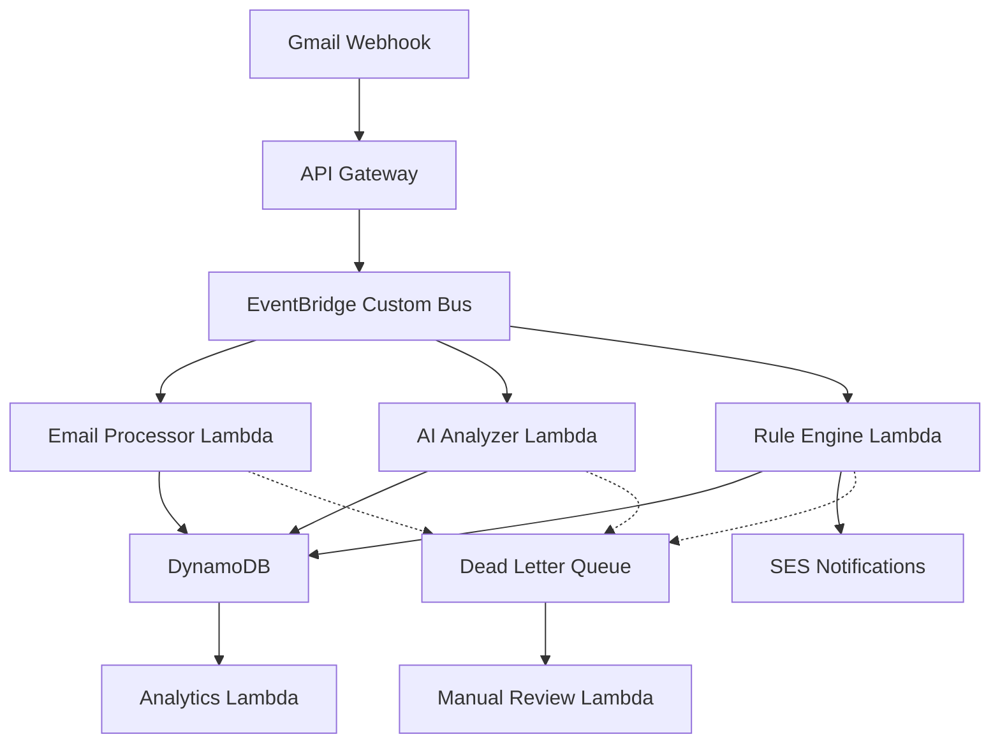

# Event-Driven Lambda Architecture for AI Rules Engine

## Architecture Overview

```
Gmail Webhook → API Gateway → EventBridge → Lambda Functions → DynamoDB
     ↓               ↓            ↓             ↓              ↓
 Rate Limiting → Auth/Validation → Event Routing → Processing → Storage
```

## 1. Event Flow Architecture

### High-Level Event Flow


### Event Types and Routing

```json
{
  "event_types": {
    "email.received": {
      "description": "New email arrived in Gmail",
      "targets": ["email-processor", "ai-analyzer"],
      "priority": "high",
      "timeout": "30s"
    },
    "rule.triggered": {
      "description": "AI rule matched an email",
      "targets": ["rule-engine", "analytics"],
      "priority": "high", 
      "timeout": "10s"
    },
    "rule.created": {
      "description": "New AI rule generated",
      "targets": ["rule-validator", "analytics"],
      "priority": "medium",
      "timeout": "15s"
    },
    "rule.performance_update": {
      "description": "Rule performance metrics updated",
      "targets": ["analytics", "optimizer"],
      "priority": "low",
      "timeout": "60s"
    },
    "user.feedback": {
      "description": "User provided feedback on rule performance",
      "targets": ["feedback-processor", "analytics"],
      "priority": "medium",
      "timeout": "20s"
    }
  }
}
```

## 2. Lambda Function Specifications

### Function 1: Email Processor (`email-processor`)

```python
# email_processor.py
import json
import boto3
from datetime import datetime
from typing import Dict, Any
import logging

logger = logging.getLogger()
logger.setLevel(logging.INFO)

def lambda_handler(event: Dict[str, Any], context) -> Dict[str, Any]:
    """
    Process incoming Gmail webhook events
    - Validate email data
    - Extract metadata
    - Store in DynamoDB
    - Trigger AI analysis
    """
    
    try:
        # Parse EventBridge event
        detail = event.get('detail', {})
        email_data = detail.get('email_data', {})
        tenant_id = detail.get('tenant_id')
        user_id = detail.get('user_id')
        
        # Validate required fields
        if not all([tenant_id, user_id, email_data]):
            raise ValueError("Missing required fields")
        
        # Extract email metadata
        email_metadata = extract_email_metadata(email_data)
        
        # Store email record
        email_record = create_email_record(tenant_id, user_id, email_metadata)
        store_email_record(email_record)
        
        # Trigger AI analysis
        trigger_ai_analysis(tenant_id, user_id, email_record['email_id'])
        
        return {
            'statusCode': 200,
            'email_id': email_record['email_id'],
            'processing_time_ms': get_processing_time()
        }
        
    except Exception as e:
        logger.error(f"Email processing failed: {str(e)}")
        # Send to DLQ for manual review
        send_to_dlq(event, str(e))
        raise

def extract_email_metadata(email_data: Dict) -> Dict:
    """Extract safe metadata from email without storing PII content"""
    return {
        'gmail_message_id': email_data.get('id'),
        'thread_id': email_data.get('threadId'),
        'received_at': email_data.get('internalDate'),
        'size_bytes': len(str(email_data)),
        'labels': email_data.get('labelIds', []),
        'headers': extract_safe_headers(email_data.get('payload', {}).get('headers', [])),
        'has_attachments': has_attachments(email_data),
        'content_features': extract_content_features(email_data)
    }

def extract_safe_headers(headers: list) -> Dict:
    """Extract only safe, non-PII headers"""
    safe_headers = {}
    allowed_headers = ['Date', 'Message-ID', 'Content-Type', 'X-Gmail-Labels']
    
    for header in headers:
        name = header.get('name', '')
        value = header.get('value', '')
        
        if name in allowed_headers:
            safe_headers[name] = value
        elif name == 'Subject':
            # Hash subject for privacy while allowing pattern matching
            safe_headers['subject_hash'] = hash_string(value)
            safe_headers['subject_length'] = len(value)
        elif name == 'From':
            # Extract only domain for sender analysis
            safe_headers['sender_domain'] = extract_domain(value)
    
    return safe_headers

# Lambda Configuration
LAMBDA_CONFIG = {
    "FunctionName": "damien-email-processor",
    "Runtime": "python3.11",
    "MemorySize": 512,
    "Timeout": 30,
    "Environment": {
        "DYNAMODB_TABLE": "damien-ai-rules-prod",
        "EVENTBRIDGE_BUS": "damien-ai-rules-bus"
    },
    "ReservedConcurrency": 100,
    "DeadLetterQueue": {
        "TargetArn": "arn:aws:sqs:region:account:damien-email-processor-dlq"
    }
}
```

### Function 2: AI Analyzer (`ai-analyzer`)

```python
# ai_analyzer.py
import json
import boto3
from typing import Dict, Any, List
import logging
from datetime import datetime, timedelta

logger = logging.getLogger()
logger.setLevel(logging.INFO)

def lambda_handler(event: Dict[str, Any], context) -> Dict[str, Any]:
    """
    Analyze email content and generate/match AI rules
    - Content analysis using ML models
    - Pattern detection
    - Rule matching
    - Rule generation suggestions
    """
    
    try:
        detail = event.get('detail', {})
        tenant_id = detail.get('tenant_id')
        user_id = detail.get('user_id')
        email_id = detail.get('email_id')
        
        # Load email metadata
        email_data = load_email_data(tenant_id, user_id, email_id)
        
        # Perform AI analysis
        analysis_results = perform_ai_analysis(email_data)
        
        # Match existing rules
        matching_rules = find_matching_rules(tenant_id, user_id, analysis_results)
        
        # Generate new rule suggestions if no matches
        rule_suggestions = []
        if not matching_rules:
            rule_suggestions = generate_rule_suggestions(analysis_results)
        
        # Store analysis results
        store_analysis_results(tenant_id, user_id, email_id, {
            'analysis': analysis_results,
            'matching_rules': matching_rules,
            'suggestions': rule_suggestions,
            'processed_at': datetime.utcnow().isoformat()
        })
        
        # Trigger rule execution if matches found
        if matching_rules:
            trigger_rule_execution(tenant_id, user_id, email_id, matching_rules)
        
        return {
            'statusCode': 200,
            'analysis_confidence': analysis_results.get('confidence', 0),
            'matching_rules_count': len(matching_rules),
            'suggestions_count': len(rule_suggestions)
        }
        
    except Exception as e:
        logger.error(f"AI analysis failed: {str(e)}")
        send_to_dlq(event, str(e))
        raise

def perform_ai_analysis(email_data: Dict) -> Dict:
    """Perform ML-based email analysis"""
    
    # Feature extraction
    features = {
        'sender_domain': email_data.get('sender_domain'),
        'subject_length': email_data.get('subject_length', 0),
        'content_features': email_data.get('content_features', {}),
        'received_hour': extract_hour(email_data.get('received_at')),
        'has_attachments': email_data.get('has_attachments', False)
    }
    
    # ML Classification (placeholder for actual model)
    classification = classify_email(features)
    
    # Pattern detection
    patterns = detect_patterns(features)
    
    # Sentiment analysis
    sentiment = analyze_sentiment(email_data.get('content_features', {}))
    
    return {
        'classification': classification,
        'patterns': patterns,
        'sentiment': sentiment,
        'confidence': classification.get('confidence', 0),
        'features': features,
        'model_version': 'damien-classifier-v2.1'
    }

def find_matching_rules(tenant_id: str, user_id: str, analysis: Dict) -> List[Dict]:
    """Find existing rules that match the email analysis"""
    
    # Query DynamoDB for user's active rules
    dynamodb = boto3.resource('dynamodb')
    table = dynamodb.Table('damien-ai-rules-prod')
    
    response = table.query(
        KeyConditionExpression=Key('PK').eq(f'TENANT#{tenant_id}') & 
                              Key('SK').begins_with(f'USER#{user_id}#RULE#'),
        FilterExpression=Attr('metadata.status').eq('active')
    )
    
    matching_rules = []
    for rule in response['Items']:
        if rule_matches_analysis(rule, analysis):
            matching_rules.append({
                'rule_id': rule['rule_id'],
                'confidence': calculate_match_confidence(rule, analysis),
                'actions': rule['rule_definition']['actions']
            })
    
    # Sort by confidence
    return sorted(matching_rules, key=lambda x: x['confidence'], reverse=True)

# Lambda Configuration
LAMBDA_CONFIG = {
    "FunctionName": "damien-ai-analyzer",
    "Runtime": "python3.11", 
    "MemorySize": 1024,
    "Timeout": 60,
    "Environment": {
        "DYNAMODB_TABLE": "damien-ai-rules-prod",
        "ML_MODEL_ENDPOINT": "damien-email-classifier-endpoint"
    },
    "ReservedConcurrency": 50
}
```

### Function 3: Rule Engine (`rule-engine`)

```python
# rule_engine.py
import json
import boto3
from typing import Dict, Any, List
import logging
from datetime import datetime

logger = logging.getLogger()
logger.setLevel(logging.INFO)

def lambda_handler(event: Dict[str, Any], context) -> Dict[str, Any]:
    """
    Execute matched rules with conflict resolution
    - Load rule definitions
    - Resolve rule conflicts
    - Execute actions
    - Update performance metrics
    """
    
    try:
        detail = event.get('detail', {})
        tenant_id = detail.get('tenant_id')
        user_id = detail.get('user_id')
        email_id = detail.get('email_id')
        matching_rules = detail.get('matching_rules', [])
        
        # Resolve rule conflicts
        resolved_rules = resolve_rule_conflicts(tenant_id, matching_rules)
        
        # Execute rules in priority order
        execution_results = []
        for rule in resolved_rules:
            result = execute_rule(tenant_id, user_id, email_id, rule)
            execution_results.append(result)
            
            # Update rule performance metrics
            update_rule_performance(tenant_id, rule['rule_id'], result)
        
        # Store execution log
        store_execution_log(tenant_id, user_id, email_id, execution_results)
        
        # Send notifications if configured
        if should_notify_user(execution_results):
            send_user_notification(tenant_id, user_id, execution_results)
        
        return {
            'statusCode': 200,
            'rules_executed': len(execution_results),
            'successful_executions': len([r for r in execution_results if r['success']]),
            'total_execution_time_ms': sum(r['execution_time_ms'] for r in execution_results)
        }
        
    except Exception as e:
        logger.error(f"Rule execution failed: {str(e)}")
        send_to_dlq(event, str(e))
        raise

def resolve_rule_conflicts(tenant_id: str, rules: List[Dict]) -> List[Dict]:
    """Advanced rule conflict resolution"""
    
    if len(rules) <= 1:
        return rules
    
    # Load full rule definitions
    full_rules = load_rule_definitions(tenant_id, [r['rule_id'] for r in rules])
    
    # Group by conflict resolution strategy
    conflict_groups = group_rules_by_strategy(full_rules)
    
    resolved_rules = []
    
    for strategy, rule_group in conflict_groups.items():
        if strategy == 'highest_confidence':
            # Take rule with highest confidence
            resolved_rules.append(max(rule_group, key=lambda r: r['confidence']))
            
        elif strategy == 'parallel_execution':
            # Execute all rules in parallel
            resolved_rules.extend(rule_group)
            
        elif strategy == 'priority_order':
            # Execute in priority order
            sorted_rules = sorted(rule_group, key=lambda r: r['priority_weight'], reverse=True)
            resolved_rules.extend(sorted_rules)
            
        elif strategy == 'dependency_chain':
            # Execute based on dependencies
            resolved_rules.extend(resolve_dependencies(rule_group))
    
    return resolved_rules

def execute_rule(tenant_id: str, user_id: str, email_id: str, rule: Dict) -> Dict:
    """Execute a single rule and return results"""
    
    start_time = datetime.utcnow()
    
    try:
        # Load rule definition
        rule_def = rule['rule_definition']
        actions = rule_def['actions']
        
        # Execute primary actions
        action_results = []
        for action_type, action_config in actions['primary_actions'].items():
            result = execute_action(action_type, action_config, email_id)
            action_results.append(result)
        
        # Execute advanced actions if configured
        if actions.get('advanced_actions'):
            for action_type, action_config in actions['advanced_actions'].items():
                if action_config:  # Only if enabled
                    result = execute_action(action_type, action_config, email_id)
                    action_results.append(result)
        
        execution_time = (datetime.utcnow() - start_time).total_seconds() * 1000
        
        return {
            'rule_id': rule['rule_id'],
            'success': True,
            'actions_executed': len(action_results),
            'action_results': action_results,
            'execution_time_ms': execution_time,
            'confidence': rule.get('confidence', 0)
        }
        
    except Exception as e:
        execution_time = (datetime.utcnow() - start_time).total_seconds() * 1000
        
        return {
            'rule_id': rule['rule_id'],
            'success': False,
            'error': str(e),
            'execution_time_ms': execution_time,
            'confidence': rule.get('confidence', 0)
        }

def execute_action(action_type: str, action_config: Any, email_id: str) -> Dict:
    """Execute a specific action on an email"""
    
    action_handlers = {
        'add_labels': add_labels_to_email,
        'remove_labels': remove_labels_from_email,
        'mark_read': mark_email_read,
        'archive_after_days': schedule_email_archive,
        'forward_to': forward_email,
        'create_calendar_event': create_calendar_event,
        'notify_user': send_notification
    }
    
    handler = action_handlers.get(action_type)
    if not handler:
        raise ValueError(f"Unknown action type: {action_type}")
    
    return handler(action_config, email_id)

# Lambda Configuration
LAMBDA_CONFIG = {
    "FunctionName": "damien-rule-engine",
    "Runtime": "python3.11",
    "MemorySize": 512,
    "Timeout": 30,
    "Environment": {
        "DYNAMODB_TABLE": "damien-ai-rules-prod",
        "GMAIL_API_ENDPOINT": "https://gmail.googleapis.com/gmail/v1"
    },
    "ReservedConcurrency": 200
}
```

## 3. EventBridge Configuration

### Custom Event Bus Setup

```json
{
  "EventBusName": "damien-ai-rules-bus",
  "EventSourceName": "damien.email.processor",
  "Rules": [
    {
      "Name": "EmailReceivedRule",
      "EventPattern": {
        "source": ["damien.email.processor"],
        "detail-type": ["Email Received"],
        "detail": {
          "tenant_id": [{"exists": true}],
          "user_id": [{"exists": true}]
        }
      },
      "Targets": [
        {
          "Id": "1",
          "Arn": "arn:aws:lambda:region:account:function:damien-email-processor"
        }
      ]
    },
    {
      "Name": "AIAnalysisRule", 
      "EventPattern": {
        "source": ["damien.ai.analyzer"],
        "detail-type": ["AI Analysis Complete"]
      },
      "Targets": [
        {
          "Id": "1",
          "Arn": "arn:aws:lambda:region:account:function:damien-rule-engine"
        }
      ]
    },
    {
      "Name": "RulePerformanceRule",
      "EventPattern": {
        "source": ["damien.rule.engine"],
        "detail-type": ["Rule Executed"]
      },
      "Targets": [
        {
          "Id": "1", 
          "Arn": "arn:aws:lambda:region:account:function:damien-analytics-processor"
        }
      ]
    }
  ]
}
```

## 4. Error Handling and Retry Strategy

### Dead Letter Queue Configuration

```json
{
  "DLQConfiguration": {
    "email-processor-dlq": {
      "QueueName": "damien-email-processor-dlq",
      "MessageRetentionPeriod": 1209600,  // 14 days
      "VisibilityTimeoutSeconds": 300,
      "ReddrivePolicy": {
        "maxReceiveCount": 3
      }
    },
    "ai-analyzer-dlq": {
      "QueueName": "damien-ai-analyzer-dlq", 
      "MessageRetentionPeriod": 1209600,
      "VisibilityTimeoutSeconds": 600,
      "ReddrivePolicy": {
        "maxReceiveCount": 2
      }
    },
    "rule-engine-dlq": {
      "QueueName": "damien-rule-engine-dlq",
      "MessageRetentionPeriod": 1209600,
      "VisibilityTimeoutSeconds": 180,
      "ReddrivePolicy": {
        "maxReceiveCount": 5
      }
    }
  }
}
```

### Retry Configuration

```python
# Exponential backoff for Lambda retries
RETRY_CONFIG = {
    "maximumRetryAttempts": 3,
    "maximumEventAge": 3600,  # 1 hour
    "retryPolicy": {
        "strategy": "exponential_backoff",
        "initialInterval": 1000,  # 1 second
        "maximumInterval": 300000,  # 5 minutes
        "backoffMultiplier": 2.0
    }
}
```

## 5. Performance Optimization

### Lambda Provisioned Concurrency

```json
{
  "ProvisionedConcurrency": {
    "email-processor": 10,
    "ai-analyzer": 5,
    "rule-engine": 15,
    "analytics-processor": 2
  },
  "AutoScaling": {
    "targetUtilization": 0.7,
    "minConcurrency": 2,
    "maxConcurrency": 100
  }
}
```

### EventBridge Optimization

```json
{
  "EventBridgeOptimization": {
    "batchSize": 10,
    "maximumBatchingWindowInSeconds": 5,
    "parallelizationFactor": 2,
    "eventFiltering": {
      "enableContentBasedDeduplication": true,
      "filterPattern": {
        "tenant_id": {"exists": true},
        "user_id": {"exists": true}
      }
    }
  }
}
```

This event-driven architecture provides real-time email processing with enterprise-grade scalability, reliability, and performance optimization.

Next: Advanced rule conflict resolution implementation.