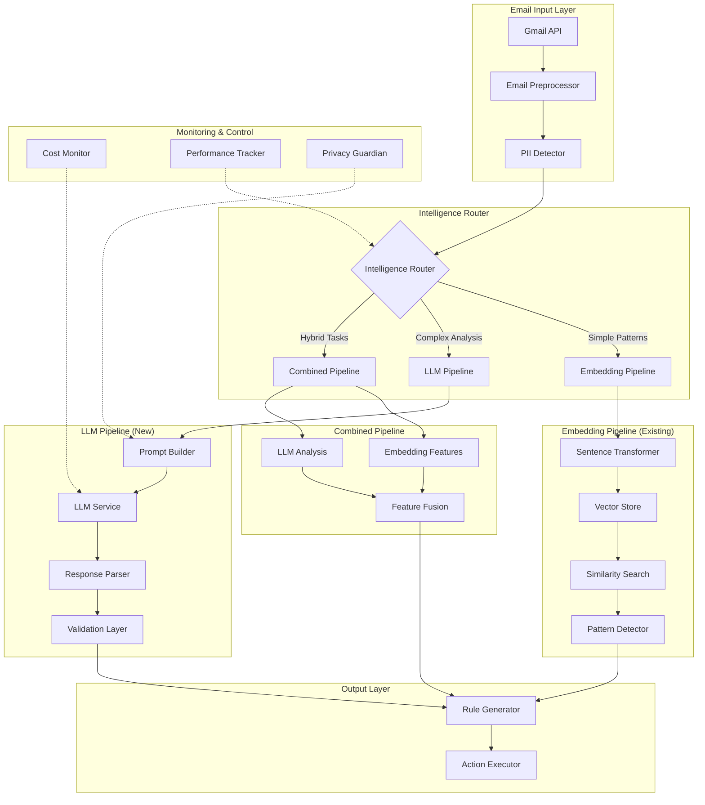

# Phase 3: External LLM Integration Implementation Plan
## Damien Email Management Platform - Advanced AI Intelligence Layer

**Version:** 1.0.0  
**Created:** December 2024  
**Status:** Planning Document  
**Architecture Standard:** Top 0.5% System Design  
**Development Standard:** Top 1% Implementation Quality

---

## Table of Contents

1. [Executive Summary](#executive-summary)
2. [Architectural Design](#architectural-design)
3. [Core Components](#core-components)
4. [Advanced Use Cases](#advanced-use-cases)
5. [Implementation Checklist](#implementation-checklist)
6. [Privacy and Security](#privacy-and-security)
7. [Performance Optimization](#performance-optimization)
8. [Testing Strategy](#testing-strategy)
9. [Deployment Plan](#deployment-plan)

---

## Executive Summary

### Project Context
Damien currently uses basic sentence transformers (all-MiniLM-L6-v2) with rule-based pattern recognition. Phase 3 will integrate external LLMs to provide sophisticated reasoning capabilities while maintaining the existing embedding pipeline for efficiency.

### Strategic Objectives
- **Enhance Intelligence**: Add LLM-powered reasoning for complex email understanding
- **Maintain Performance**: Keep embedding pipeline for fast similarity searches
- **Enable Advanced Features**: Unlock capabilities impossible with current approach
- **Ensure Privacy**: Implement robust data protection for LLM interactions
- **Optimize Costs**: Smart routing between embeddings and LLMs

### Key Deliverables
1. **LLM Service Layer**: Modular integration supporting multiple providers
2. **Prompt Engineering System**: Optimized prompts for email intelligence
3. **Hybrid Processing Pipeline**: Intelligent routing between embeddings and LLMs
4. **Privacy-Preserving Framework**: PII protection and data minimization
5. **Cost Management System**: Usage tracking and optimization

---

## Architectural Design

### System Architecture Overview



### Data Flow Architecture

```python
# High-level data flow representation
class EmailIntelligenceFlow:
    """
    1. Email Ingestion
       ├── Gmail API fetch
       ├── Metadata extraction
       └── Content preprocessing
    
    2. Privacy Protection
       ├── PII detection
       ├── Content sanitization
       └── Anonymization layer
    
    3. Intelligence Routing
       ├── Complexity assessment
       ├── Cost evaluation
       └── Pipeline selection
    
    4. Processing Pipelines
       ├── Embedding Pipeline (fast, cheap)
       │   ├── Vector generation
       │   ├── Similarity matching
       │   └── Pattern extraction
       │
       ├── LLM Pipeline (slow, expensive)
       │   ├── Prompt construction
       │   ├── Context injection
       │   ├── LLM inference
       │   └── Response parsing
       │
       └── Hybrid Pipeline (balanced)
           ├── Embedding features
           ├── LLM reasoning
           └── Result fusion
    
    5. Result Generation
       ├── Rule creation
       ├── Action recommendations
       └── Confidence scoring
    """
```

### Component Interaction Diagram

```yaml
Component Interactions:
  EmailPreprocessor:
    outputs: [PIIDetector, IntelligenceRouter]
    dependencies: [GmailAPI]
    
  IntelligenceRouter:
    inputs: [ProcessedEmail, CostBudget, PerformanceRequirements]
    outputs: [EmbeddingPipeline, LLMPipeline, HybridPipeline]
    decision_factors:
      - email_complexity_score
      - required_response_time
      - available_cost_budget
      - task_type
    
  LLMService:
    providers:
      - OpenAI (GPT-4, GPT-3.5)
      - Anthropic (Claude 3)
      - Google (Gemini Pro)
      - Local (Ollama)
    features:
      - provider_fallback
      - rate_limiting
      - response_caching
      - token_optimization
    
  PromptBuilder:
    templates:
      - intent_classification
      - importance_ranking
      - content_summarization
      - rule_generation
      - automation_suggestion
    optimizations:
      - dynamic_context_injection
      - few_shot_examples
      - chain_of_thought
      - structured_output
```

---

## Core Components

### 1. LLM Service Integration Layer

```python
# damien_cli/features/ai_intelligence/llm_integration/service.py

from abc import ABC, abstractmethod
from typing import Dict, List, Optional, Any, AsyncGenerator
from dataclasses import dataclass
from enum import Enum
import asyncio
from datetime import datetime

class LLMProvider(Enum):
    OPENAI = "openai"
    ANTHROPIC = "anthropic"
    GOOGLE = "google"
    LOCAL = "local"

@dataclass
class LLMRequest:
    """Standardized LLM request format"""
    prompt: str
    system_prompt: Optional[str] = None
    max_tokens: int = 2000
    temperature: float = 0.3
    top_p: float = 0.95
    stream: bool = False
    response_format: Optional[Dict[str, Any]] = None
    stop_sequences: Optional[List[str]] = None
    metadata: Dict[str, Any] = None

@dataclass
class LLMResponse:
    """Standardized LLM response format"""
    content: str
    model: str
    provider: LLMProvider
    usage: Dict[str, int]  # tokens, cost
    latency_ms: float
    finish_reason: str
    metadata: Dict[str, Any] = None

class BaseLLMService(ABC):
    """Abstract base for LLM service providers"""
    
    def __init__(self, config: Dict[str, Any]):
        self.config = config
        self.rate_limiter = self._init_rate_limiter()
        self.cache = self._init_cache()
    
    @abstractmethod
    async def complete(self, request: LLMRequest) -> LLMResponse:
        """Generate completion"""
        pass
    
    @abstractmethod
    async def stream_complete(
        self, request: LLMRequest
    ) -> AsyncGenerator[str, None]:
        """Stream completion"""
        pass
    
    @abstractmethod
    def estimate_cost(self, request: LLMRequest) -> float:
        """Estimate request cost"""
        pass
    
    @abstractmethod
    def validate_request(self, request: LLMRequest) -> bool:
        """Validate request parameters"""
        pass

class LLMServiceOrchestrator:
    """Orchestrates multiple LLM providers with fallback"""
    
    def __init__(self):
        self.providers = self._init_providers()
        self.router = IntelligentRouter()
        self.monitor = UsageMonitor()
    
    async def process(
        self,
        request: LLMRequest,
        preferred_provider: Optional[LLMProvider] = None,
        budget_limit: Optional[float] = None
    ) -> LLMResponse:
        """Process request with intelligent routing"""
        
        # Select provider based on multiple factors
        provider = self.router.select_provider(
            request=request,
            preferred=preferred_provider,
            budget=budget_limit,
            provider_status=self._get_provider_status()
        )
        
        # Execute with fallback
        try:
            response = await self._execute_with_fallback(
                request, provider
            )
            
            # Track usage
            self.monitor.track(provider, response)
            
            return response
            
        except Exception as e:
            # Log and handle errors
            await self._handle_error(e, request, provider)
            raise
```

### 2. Prompt Engineering Module

```python
# damien_cli/features/ai_intelligence/llm_integration/prompts.py

from typing import Dict, List, Optional, Any
from abc import ABC, abstractmethod
from jinja2 import Template
import json

class PromptTemplate(ABC):
    """Base class for prompt templates"""
    
    def __init__(self, template_str: str):
        self.template = Template(template_str)
        self.examples = []
        self.constraints = []
    
    @abstractmethod
    def build(self, context: Dict[str, Any]) -> str:
        """Build prompt with context"""
        pass
    
    def add_examples(self, examples: List[Dict[str, Any]]):
        """Add few-shot examples"""
        self.examples.extend(examples)
    
    def add_constraints(self, constraints: List[str]):
        """Add output constraints"""
        self.constraints.extend(constraints)

class EmailAnalysisPrompts:
    """Collection of email analysis prompts"""
    
    INTENT_CLASSIFICATION = """
You are an expert email analyst. Analyze the following email and classify its intent.

Email Details:
- From: {{ email.from_sender }}
- Subject: {{ email.subject }}
- Content: {{ email.content | truncate(500) }}
- Metadata: {{ email.metadata | tojson }}

Classify the email intent into one of these categories:
1. TRANSACTIONAL - Order confirmations, receipts, shipping notifications
2. PROMOTIONAL - Marketing, sales, discounts, newsletters
3. PERSONAL - Personal communications from individuals
4. WORK - Work-related, professional communications
5. NOTIFICATION - System notifications, alerts, updates
6. SOCIAL - Social media notifications
7. SPAM - Unwanted, potentially harmful content

Additionally, provide:
- Confidence score (0-1)
- Key indicators that led to this classification
- Secondary intent if applicable
- Suggested actions

Output in JSON format:
{
  "primary_intent": "CATEGORY",
  "confidence": 0.95,
  "indicators": ["indicator1", "indicator2"],
  "secondary_intent": "CATEGORY or null",
  "suggested_actions": ["action1", "action2"]
}
"""

    IMPORTANCE_RANKING = """
You are an email prioritization expert. Analyze this email and determine its importance level.

Email Context:
{{ email | tojson(indent=2) }}

User Context:
- Email patterns: {{ user_patterns | tojson }}
- Historical behavior: {{ user_behavior | tojson }}
- Current priorities: {{ priorities | tojson }}

Evaluate importance based on:
1. Sender importance (known contact, VIP, frequency)
2. Content urgency (deadlines, time-sensitive info)
3. Personal relevance (mentions user, requires action)
4. Business impact (financial, project-critical)
5. Emotional significance (personal relationships)

Output a detailed importance analysis:
{
  "importance_score": 0-100,
  "urgency_level": "IMMEDIATE|HIGH|MEDIUM|LOW",
  "factors": {
    "sender_importance": 0-100,
    "content_urgency": 0-100,
    "personal_relevance": 0-100,
    "business_impact": 0-100,
    "emotional_significance": 0-100
  },
  "key_phrases": ["phrase1", "phrase2"],
  "recommended_action": "description",
  "reasoning": "detailed explanation"
}
"""

    SMART_SUMMARIZATION = """
You are an expert at creating actionable email summaries. Create a multi-level summary of this email.

Email Content:
{{ email.full_content }}

Create three summary levels:
1. One-line summary (max 100 chars) - capture the essence
2. Executive summary (max 300 chars) - key points and required actions
3. Detailed summary - all important information, structured by topic

Additionally extract:
- Action items with deadlines
- Key decisions required
- Important dates/times
- Names and roles mentioned
- Attachments and their purpose
- Links and their context

Format:
{
  "one_line": "string",
  "executive": "string",
  "detailed": {
    "main_topics": ["topic1", "topic2"],
    "key_points": ["point1", "point2"],
    "context": "string"
  },
  "extractions": {
    "action_items": [{"task": "", "deadline": "", "assignee": ""}],
    "decisions_needed": ["decision1"],
    "dates": [{"date": "", "event": ""}],
    "people": [{"name": "", "role": "", "context": ""}],
    "attachments": [{"name": "", "purpose": ""}],
    "links": [{"url": "", "context": ""}]
  }
}
"""

    PATTERN_LEARNING = """
Analyze these emails to identify patterns and suggest automation rules.

Email Set:
{{ emails | tojson(indent=2) }}

Current Rules:
{{ existing_rules | tojson }}

Identify patterns in:
1. Sender patterns (domains, individuals, frequencies)
2. Subject patterns (keywords, formats, recurring themes)
3. Content patterns (structure, language, intent)
4. Temporal patterns (time of day, day of week, frequency)
5. Action patterns (user typically archives, labels, etc.)

For each pattern found:
- Calculate confidence based on occurrence frequency
- Identify exceptions or edge cases
- Suggest specific automation rules
- Estimate time savings

Output format:
{
  "patterns": [
    {
      "type": "sender|subject|content|temporal|action",
      "description": "clear description",
      "confidence": 0.95,
      "occurrences": 45,
      "examples": ["example1", "example2"],
      "exceptions": ["exception1"],
      "suggested_rule": {
        "conditions": [{"field": "", "operator": "", "value": ""}],
        "actions": [{"type": "", "parameters": {}}],
        "estimated_impact": {
          "emails_affected_per_month": 120,
          "time_saved_minutes": 20
        }
      }
    }
  ],
  "insights": ["insight1", "insight2"],
  "optimization_opportunities": ["opportunity1"]
}
"""

class PromptOptimizer:
    """Optimizes prompts for better performance"""
    
    def __init__(self):
        self.token_counter = TokenCounter()
        self.example_selector = DynamicExampleSelector()
    
    def optimize_prompt(
        self,
        template: PromptTemplate,
        context: Dict[str, Any],
        max_tokens: int = 2000,
        model: str = "gpt-4"
    ) -> str:
        """Optimize prompt for token limit and relevance"""
        
        # Start with base prompt
        prompt = template.build(context)
        
        # Add relevant examples within token budget
        examples = self.example_selector.select_examples(
            template.examples,
            context,
            max_examples=3
        )
        
        # Compress if needed
        if self.token_counter.count(prompt, model) > max_tokens:
            prompt = self._compress_prompt(prompt, max_tokens, model)
        
        return prompt
    
    def _compress_prompt(
        self, prompt: str, max_tokens: int, model: str
    ) -> str:
        """Compress prompt to fit token limit"""
        # Implementation of smart compression
        pass
```

### 3. Context Window Optimization

```python
# damien_cli/features/ai_intelligence/llm_integration/context_optimizer.py

from typing import List, Dict, Any, Tuple
import numpy as np
from dataclasses import dataclass

@dataclass
class ContextItem:
    """Individual context item with priority"""
    content: str
    priority: float
    token_count: int
    category: str
    metadata: Dict[str, Any]

class ContextWindowOptimizer:
    """Optimizes context for LLM token limits"""
    
    def __init__(self, max_tokens: int = 8000):
        self.max_tokens = max_tokens
        self.reserved_tokens = 2000  # For prompt and response
        self.prioritizer = ContextPrioritizer()
    
    def optimize_context(
        self,
        items: List[ContextItem],
        required_items: List[ContextItem] = None,
        target_tokens: Optional[int] = None
    ) -> List[ContextItem]:
        """Optimize context items to fit token limit"""
        
        if target_tokens is None:
            target_tokens = self.max_tokens - self.reserved_tokens
        
        # Always include required items
        selected = required_items or []
        used_tokens = sum(item.token_count for item in selected)
        
        # Sort remaining items by priority
        remaining = [i for i in items if i not in selected]
        remaining.sort(key=lambda x: x.priority, reverse=True)
        
        # Greedy selection with diversity
        categories_seen = set()
        for item in remaining:
            if used_tokens + item.token_count <= target_tokens:
                # Boost priority for category diversity
                if item.category not in categories_seen:
                    selected.append(item)
                    used_tokens += item.token_count
                    categories_seen.add(item.category)
                elif item.priority > 0.8:  # High priority items
                    selected.append(item)
                    used_tokens += item.token_count
        
        return selected
    
    def create_sliding_window(
        self,
        emails: List[Dict[str, Any]],
        window_size: int = 10,
        overlap: int = 2
    ) -> List[List[Dict[str, Any]]]:
        """Create overlapping windows for batch processing"""
        
        windows = []
        for i in range(0, len(emails), window_size - overlap):
            window = emails[i:i + window_size]
            if window:
                windows.append(window)
        
        return windows
    
    def compress_email_content(
        self,
        email: Dict[str, Any],
        target_length: int = 500
    ) -> str:
        """Intelligently compress email content"""
        
        content = email.get('content', '')
        
        # If already short enough, return as-is
        if len(content) <= target_length:
            return content
        
        # Smart truncation preserving important parts
        lines = content.split('\n')
        important_lines = []
        
        # Priority patterns
        priority_patterns = [
            'action required',
            'deadline',
            'urgent',
            'important',
            'please',
            'would you',
            'can you'
        ]
        
        # First pass: collect important lines
        for line in lines:
            line_lower = line.lower()
            if any(pattern in line_lower for pattern in priority_patterns):
                important_lines.append(line)
        
        # Build compressed version
        compressed = '\n'.join(important_lines)
        
        # If still too long, truncate with ellipsis
        if len(compressed) > target_length:
            compressed = compressed[:target_length-3] + '...'
        
        return compressed
```

### 4. Email Preprocessing Pipeline

```python
# damien_cli/features/ai_intelligence/llm_integration/preprocessor.py

from typing import Dict, List, Any, Optional, Tuple
import re
from datetime import datetime
import hashlib

class EmailPreprocessor:
    """Preprocesses emails for LLM consumption"""
    
    def __init__(self):
        self.pii_detector = PIIDetector()
        self.content_cleaner = ContentCleaner()
        self.metadata_extractor = MetadataExtractor()
    
    def preprocess(
        self,
        email: Dict[str, Any],
        mode: str = "balanced"  # minimal, balanced, full
    ) -> Dict[str, Any]:
        """Preprocess email for LLM analysis"""
        
        # Extract metadata
        metadata = self.metadata_extractor.extract(email)
        
        # Clean content
        cleaned_content = self.content_cleaner.clean(
            email.get('content', ''),
            mode=mode
        )
        
        # Detect and handle PII
        pii_report = self.pii_detector.scan(cleaned_content)
        if pii_report['has_pii']:
            cleaned_content = self.pii_detector.redact(
                cleaned_content,
                pii_report['entities']
            )
        
        # Structure for LLM
        preprocessed = {
            'email_id': email.get('id'),
            'metadata': metadata,
            'content': {
                'subject': email.get('subject', ''),
                'body': cleaned_content,
                'snippet': email.get('snippet', '')[:200]
            },
            'features': self._extract_features(email, cleaned_content),
            'pii_status': pii_report,
            'preprocessing_mode': mode
        }
        
        return preprocessed
    
    def _extract_features(
        self,
        email: Dict[str, Any],
        content: str
    ) -> Dict[str, Any]:
        """Extract features for LLM context"""
        
        return {
            'length': len(content),
            'has_attachments': email.get('has_attachments', False),
            'attachment_count': len(email.get('attachments', [])),
            'is_thread': email.get('thread_id') is not None,
            'label_count': len(email.get('label_names', [])),
            'has_links': bool(re.search(r'https?://', content)),
            'language_detected': self._detect_language(content),
            'sentiment_hint': self._quick_sentiment(content)
        }
    
    def _detect_language(self, text: str) -> str:
        """Simple language detection"""
        # Simplified - in production use langdetect or similar
        return "en"
    
    def _quick_sentiment(self, text: str) -> str:
        """Quick sentiment analysis"""
        positive_words = ['thank', 'please', 'great', 'excellent', 'happy']
        negative_words = ['sorry', 'problem', 'issue', 'error', 'failed']
        
        text_lower = text.lower()
        pos_count = sum(1 for word in positive_words if word in text_lower)
        neg_count = sum(1 for word in negative_words if word in text_lower)
        
        if pos_count > neg_count:
            return "positive"
        elif neg_count > pos_count:
            return "negative"
        else:
            return "neutral"

class PIIDetector:
    """Detects and handles PII in email content"""
    
    def __init__(self):
        self.patterns = {
            'email': r'\b[A-Za-z0-9._%+-]+@[A-Za-z0-9.-]+\.[A-Z|a-z]{2,}\b',
            'phone': r'(\+?1[-.\s]?)?\(?([0-9]{3})\)?[-.\s]?([0-9]{3})[-.\s]?([0-9]{4})',
            'ssn': r'\b\d{3}-\d{2}-\d{4}\b',
            'credit_card': r'\b\d{4}[\s-]?\d{4}[\s-]?\d{4}[\s-]?\d{4}\b',
            'ip_address': r'\b(?:[0-9]{1,3}\.){3}[0-9]{1,3}\b'
        }
    
    def scan(self, text: str) -> Dict[str, Any]:
        """Scan text for PII"""
        
        entities = []
        for pii_type, pattern in self.patterns.items():
            matches = re.finditer(pattern, text)
            for match in matches:
                entities.append({
                    'type': pii_type,
                    'value': match.group(),
                    'start': match.start(),
                    'end': match.end()
                })
        
        return {
            'has_pii': len(entities) > 0,
            'entity_count': len(entities),
            'entities': entities
        }
    
    def redact(
        self,
        text: str,
        entities: List[Dict[str, Any]]
    ) -> str:
        """Redact PII from text"""
        
        # Sort entities by position (reverse to maintain positions)
        entities.sort(key=lambda x: x['start'], reverse=True)
        
        redacted = text
        for entity in entities:
            replacement = f"[{entity['type'].upper()}_REDACTED]"
            redacted = (
                redacted[:entity['start']] +
                replacement +
                redacted[entity['end']:]
            )
        
        return redacted
    
    def create_pii_safe_hash(self, pii_value: str) -> str:
        """Create consistent hash for PII tracking"""
        return hashlib.sha256(pii_value.encode()).hexdigest()[:12]
```

### 5. Pattern Detection Enhancement

```python
# damien_cli/features/ai_intelligence/llm_integration/pattern_enhancer.py

from typing import List, Dict, Any, Optional
import numpy as np
from sklearn.cluster import DBSCAN
from collections import defaultdict

class LLMPatternEnhancer:
    """Enhances pattern detection with LLM insights"""
    
    def __init__(self, llm_service: BaseLLMService):
        self.llm_service = llm_service
        self.pattern_prompts = PatternAnalysisPrompts()
    
    async def enhance_patterns(
        self,
        patterns: List[Dict[str, Any]],
        emails: List[Dict[str, Any]],
        context: Dict[str, Any]
    ) -> List[Dict[str, Any]]:
        """Enhance patterns with LLM analysis"""
        
        enhanced_patterns = []
        
        for pattern in patterns:
            # Get relevant emails for this pattern
            pattern_emails = self._get_pattern_emails(pattern, emails)
            
            # Create analysis prompt
            prompt = self.pattern_prompts.build_pattern_analysis(
                pattern=pattern,
                sample_emails=pattern_emails[:5],  # Sample
                user_context=context
            )
            
            # Get LLM insights
            request = LLMRequest(
                prompt=prompt,
                temperature=0.3,
                response_format={"type": "json"}
            )
            
            response = await self.llm_service.complete(request)
            insights = json.loads(response.content)
            
            # Enhance pattern with insights
            enhanced_pattern = {
                **pattern,
                'llm_insights': insights,
                'refined_confidence': self._refine_confidence(
                    pattern['confidence'],
                    insights['confidence_adjustment']
                ),
                'advanced_characteristics': insights['characteristics'],
                'automation_potential': insights['automation_score'],
                'natural_language_description': insights['description']
            }
            
            enhanced_patterns.append(enhanced_pattern)
        
        return enhanced_patterns
    
    def _refine_confidence(
        self,
        original: float,
        adjustment: float
    ) -> float:
        """Refine confidence score with LLM adjustment"""
        # Weighted average with bounds
        refined = (original * 0.7) + (adjustment * 0.3)
        return max(0.0, min(1.0, refined))
    
    async def discover_complex_patterns(
        self,
        emails: List[Dict[str, Any]],
        existing_patterns: List[Dict[str, Any]]
    ) -> List[Dict[str, Any]]:
        """Discover complex patterns using LLM reasoning"""
        
        # Prepare email summaries
        email_summaries = [
            self._create_email_summary(email) for email in emails[:100]
        ]
        
        # Create discovery prompt
        prompt = self.pattern_prompts.build_discovery_prompt(
            email_summaries=email_summaries,
            known_patterns=existing_patterns
        )
        
        request = LLMRequest(
            prompt=prompt,
            temperature=0.5,  # More creative for discovery
            max_tokens=3000
        )
        
        response = await self.llm_service.complete(request)
        discovered = json.loads(response.content)
        
        # Validate and enrich discoveries
        validated_patterns = []
        for pattern in discovered['patterns']:
            if self._validate_pattern(pattern, emails):
                validated_patterns.append({
                    'pattern_type': 'llm_discovered',
                    'discovery_method': 'advanced_reasoning',
                    **pattern
                })
        
        return validated_patterns
```

### 6. Rule Generation System

```python
# damien_cli/features/ai_intelligence/llm_integration/rule_generator.py

from typing import List, Dict, Any, Optional, Tuple
from damien_cli.features.rule_management.models import RuleModel

class AdvancedRuleGenerator:
    """Generates sophisticated rules using LLM reasoning"""
    
    def __init__(self, llm_service: BaseLLMService):
        self.llm_service = llm_service
        self.rule_validator = RuleValidator()
        self.impact_calculator = ImpactCalculator()
    
    async def generate_rules_from_patterns(
        self,
        patterns: List[Dict[str, Any]],
        user_preferences: Dict[str, Any],
        existing_rules: List[RuleModel]
    ) -> List[Dict[str, Any]]:
        """Generate rules from detected patterns"""
        
        generated_rules = []
        
        for pattern in patterns:
            # Check if pattern warrants a rule
            if not self._should_create_rule(pattern, existing_rules):
                continue
            
            # Generate rule using LLM
            rule_spec = await self._generate_rule_spec(
                pattern, user_preferences
            )
            
            # Validate and refine
            if self.rule_validator.validate(rule_spec):
                # Calculate impact
                impact = self.impact_calculator.calculate(
                    rule_spec, patterns
                )
                
                generated_rules.append({
                    'rule': rule_spec,
                    'pattern_source': pattern,
                    'impact_analysis': impact,
                    'confidence': pattern.get('refined_confidence', 0.8)
                })
        
        # Rank by impact and confidence
        generated_rules.sort(
            key=lambda x: x['impact_analysis']['score'] * x['confidence'],
            reverse=True
        )
        
        return generated_rules
    
    async def generate_natural_language_rule(
        self,
        instruction: str,
        context: Dict[str, Any]
    ) -> Tuple[RuleModel, Dict[str, Any]]:
        """Generate rule from natural language instruction"""
        
        # Build understanding prompt
        prompt = f"""
Convert this email management instruction into a precise rule specification:

Instruction: "{instruction}"

User Context:
- Email volume: {context.get('email_volume', 'unknown')}
- Common senders: {context.get('common_senders', [])}
- Existing rules: {len(context.get('existing_rules', []))}

Generate a rule with:
1. Clear conditions (be specific about matching criteria)
2. Appropriate actions
3. Consider edge cases
4. Avoid conflicts with existing rules

Output format:
{{
  "name": "descriptive name",
  "description": "what this rule does",
  "conditions": [
    {{"field": "from|to|subject|body|label|age_days",
      "operator": "contains|equals|greater_than",
      "value": "specific value"}}
  ],
  "actions": [
    {{"type": "archive|label|trash|forward",
      "parameters": {{}}}}
  ],
  "exceptions": ["list any exceptions"],
  "confidence": 0.0-1.0,
  "reasoning": "explanation of interpretation"
}}
"""
        
        request = LLMRequest(
            prompt=prompt,
            temperature=0.2,
            response_format={"type": "json"}
        )
        
        response = await self.llm_service.complete(request)
        rule_spec = json.loads(response.content)
        
        # Convert to RuleModel
        rule = self._spec_to_rule_model(rule_spec)
        
        # Create metadata
        metadata = {
            'original_instruction': instruction,
            'llm_interpretation': rule_spec['reasoning'],
            'confidence': rule_spec['confidence'],
            'exceptions_noted': rule_spec.get('exceptions', [])
        }
        
        return rule, metadata
    
    async def suggest_rule_improvements(
        self,
        rule: RuleModel,
        performance_data: Dict[str, Any]
    ) -> List[Dict[str, Any]]:
        """Suggest improvements for existing rules"""
        
        prompt = f"""
Analyze this email rule and suggest improvements:

Current Rule:
{rule.to_dict()}

Performance Data:
- Emails matched: {performance_data.get('match_count', 0)}
- False positives: {performance_data.get('false_positives', 0)}
- User corrections: {performance_data.get('corrections', [])}

Suggest improvements for:
1. Accuracy (reduce false positives/negatives)
2. Efficiency (optimize conditions)
3. Coverage (catch more relevant emails)
4. Specificity (avoid over-broad matching)

Output format:
{{
  "improvements": [
    {{
      "type": "accuracy|efficiency|coverage|specificity",
      "description": "what to improve",
      "current_issue": "what's wrong",
      "suggested_change": {{
        "conditions": [...],
        "actions": [...]
      }},
      "expected_impact": "how this helps"
    }}
  ],
  "risk_assessment": "potential risks of changes",
  "priority": "high|medium|low"
}}
"""
        
        request = LLMRequest(prompt=prompt, temperature=0.3)
        response = await self.llm_service.complete(request)
        
        return json.loads(response.content)['improvements']
```

---

## Advanced Use Cases

### 1. Intent Classification Beyond Simple Categorization

```python
class AdvancedIntentClassifier:
    """Multi-dimensional intent classification"""
    
    async def classify(self, email: Dict[str, Any]) -> Dict[str, Any]:
        """
        Returns:
        {
          "primary_intent": "TRANSACTIONAL",
          "intent_confidence": 0.92,
          "sub_intents": ["ORDER_CONFIRMATION", "SHIPPING_UPDATE"],
          "action_required": true,
          "urgency": "medium",
          "business_impact": "low",
          "emotional_tone": "neutral",
          "sender_relationship": "vendor",
          "content_complexity": "simple",
          "response_needed": false,
          "automation_safe": true
        }
        """
```

**Benefits Over Current Approach:**
- Understands nuanced intent combinations
- Detects action requirements automatically
- Assesses emotional tone and urgency
- Provides automation safety scores

### 2. Contextual Importance Ranking

```python
class ContextualImportanceRanker:
    """Ranks emails based on user context and content understanding"""
    
    async def rank(
        self,
        email: Dict[str, Any],
        user_context: Dict[str, Any]
    ) -> Dict[str, Any]:
        """
        Considers:
        - Current projects and deadlines
        - Relationship with sender
        - Historical interaction patterns
        - Content relevance to current work
        - Time sensitivity
        - Cascade effects of not responding
        """
```

**Benefits Over Current Approach:**
- Understands project context
- Weighs relationship importance
- Detects hidden urgency
- Predicts consequences of inaction

### 3. Intelligent Content Summarization

```python
class IntelligentSummarizer:
    """Multi-level, action-oriented summarization"""
    
    async def summarize(self, email: Dict[str, Any]) -> Dict[str, Any]:
        """
        Provides:
        - One-line summary for inbox view
        - Executive summary with key points
        - Detailed summary with structure
        - Extracted action items with owners
        - Key decisions required
        - Important dates and deadlines
        - Related email thread context
        """
```

**Benefits Over Current Approach:**
- Extracts actionable insights
- Identifies decision points
- Links to related communications
- Provides hierarchical summaries

### 4. Behavioral Pattern Learning

```python
class BehavioralPatternLearner:
    """Learns user behavior patterns for better predictions"""
    
    async def learn_patterns(
        self,
        user_actions: List[Dict[str, Any]],
        email_history: List[Dict[str, Any]]
    ) -> Dict[str, Any]:
        """
        Identifies:
        - Reading patterns (when, what, how long)
        - Response patterns (timing, style, recipients)
        - Archival patterns (what gets kept/deleted)
        - Priority patterns (what gets immediate attention)
        - Delegation patterns (what gets forwarded)
        """
```

**Benefits Over Current Approach:**
- Learns individual user preferences
- Predicts likely user actions
- Adapts to changing behaviors
- Provides personalized recommendations

### 5. Multi-Step Automation Workflows

```python
class WorkflowAutomationEngine:
    """Creates complex, multi-step automation workflows"""
    
    async def generate_workflow(
        self,
        trigger: Dict[str, Any],
        context: Dict[str, Any]
    ) -> Dict[str, Any]:
        """
        Example workflow:
        1. If email from customer contains "urgent"
        2. Check CRM for customer tier
        3. If tier = "Premium", forward to support lead
        4. Create Jira ticket with email content
        5. Send acknowledgment to customer
        6. Set follow-up reminder for 2 hours
        """
```

**Benefits Over Current Approach:**
- Chains multiple actions intelligently
- Integrates with external systems
- Handles conditional logic
- Provides workflow visualization

### 6. Natural Language Rule Creation

```python
class NaturalLanguageRuleCreator:
    """Converts conversational instructions to precise rules"""
    
    async def create_rule(self, instruction: str) -> RuleModel:
        """
        Examples:
        - "Keep all receipts in a separate folder"
        - "Alert me immediately for emails from my boss marked urgent"
        - "Archive newsletters I haven't opened in 3 days"
        - "Forward customer complaints to support, but only during business hours"
        """
```

**Benefits Over Current Approach:**
- No technical knowledge required
- Handles complex conditions naturally
- Suggests refinements and edge cases
- Learns from user corrections

### 7. Anomaly Detection and Alerts

```python
class AnomalyDetector:
    """Detects unusual email patterns requiring attention"""
    
    async def detect_anomalies(
        self,
        email_stream: List[Dict[str, Any]],
        baseline: Dict[str, Any]
    ) -> List[Dict[str, Any]]:
        """
        Detects:
        - Unusual sender patterns (first-time, spoofing)
        - Abnormal email volumes
        - Suspicious content patterns
        - Out-of-pattern requests
        - Potential security threats
        """
```

**Benefits Over Current Approach:**
- Identifies subtle anomalies
- Provides security insights
- Learns normal patterns
- Reduces false positives over time

---

## Implementation Checklist

### Phase 3.1: Foundation (Weeks 1-2)

- [~] **LLM Service Architecture** (Core structures created, testing blocked by import issue)
  - [~] Design abstract LLM service interface (`BaseLLMService`, `LLMRequest`, `LLMResponse` created)
  - [~] Implement OpenAI provider with GPT-4/GPT-3.5 (`openai_provider.py` created)
  - [~] Add Anthropic Claude provider (`anthropic_provider.py` created)
  - [~] Create local LLM provider (Ollama) (`local_provider.py` created)
  - [ ] Build provider selection logic (`ProviderSelector` is placeholder in `base.py`)
  - [ ] Implement fallback mechanisms (Placeholder in `LLMServiceOrchestrator`)

- [~] **Prompt Engineering System** (Core structures created)
  - [~] Create prompt template framework (`PromptTemplate` in `prompts.py` created)
  - [~] Build email analysis prompt library (`EmailAnalysisPrompts` in `prompts.py` created)
  - [~] Implement dynamic example selection (`DynamicExampleSelector` in `prompts.py` refined, uses placeholder embedding service)
  - [~] Add prompt optimization logic (`PromptOptimizer` structure in `prompts.py` exists)
  - [ ] Create prompt versioning system

- [~] **Privacy Framework** (Core structures created)
  - [~] Build PII detection system (`PrivacyGuardian` structure in `privacy.py` created)
  - [ ] Implement content sanitization (Placeholder within `PrivacyGuardian`)
  - [~] Create audit logging (`AuditLogger` in `privacy.py` created)
  - [ ] Add consent management
  - [ ] Build data retention policies

### Phase 3.2: Core Integration (Weeks 3-4)

- [ ] **Intelligence Router**
  - [ ] Build complexity assessment algorithm
  - [ ] Implement cost estimation logic
  - [ ] Create pipeline selection rules
  - [ ] Add performance monitoring
  - [ ] Build routing analytics

- [ ] **Context Management**
  - [ ] Implement context window optimizer
  - [ ] Build sliding window processor
  - [ ] Create context prioritization
  - [ ] Add memory management
  - [ ] Implement context caching

- [ ] **Integration Layer**
  - [ ] Connect to existing embedding pipeline
  - [ ] Build unified processing interface
  - [ ] Create result aggregation logic
  - [ ] Implement error boundaries
  - [ ] Add circuit breakers

### Phase 3.3: Advanced Features (Weeks 5-6)

- [ ] **Enhanced Pattern Detection**
  - [ ] Integrate LLM pattern analysis
  - [ ] Build complex pattern discovery
  - [ ] Add pattern validation logic
  - [ ] Create pattern explanation system
  - [ ] Implement confidence refinement

- [ ] **Intelligent Rule Generation**
  - [ ] Build rule generation from patterns
  - [ ] Implement natural language rules
  - [ ] Add rule conflict detection
  - [ ] Create rule testing framework
  - [ ] Build rule optimization logic

- [ ] **Advanced Analytics**
  - [ ] Implement importance ranking
  - [ ] Build summarization system
  - [ ] Create behavioral learning
  - [ ] Add anomaly detection
  - [ ] Build insight generation

### Phase 3.4: Optimization (Weeks 7-8)

- [ ] **Performance Optimization**
  - [ ] Implement request batching
  - [ ] Build response caching
  - [ ] Add predictive prefetching
  - [ ] Optimize prompt tokens
  - [ ] Create load balancing

- [ ] **Cost Management**
  - [ ] Build usage tracking
  - [ ] Implement budget controls
  - [ ] Add cost prediction
  - [ ] Create optimization recommendations
  - [ ] Build billing integration

- [ ] **Monitoring & Observability**
  - [ ] Add comprehensive logging
  - [ ] Build performance dashboards
  - [ ] Create alert system
  - [ ] Implement A/B testing
  - [ ] Add user feedback loops

### Phase 3.5: Testing & Deployment (Weeks 9-10)

- [ ] **Testing Suite**
  - [ ] Unit tests for all components
  - [ ] Integration tests for pipelines
  - [ ] Performance benchmarks
  - [ ] Security testing
  - [ ] User acceptance testing

- [ ] **Documentation**
  - [ ] API documentation
  - [ ] Integration guides
  - [ ] Performance tuning guide
  - [ ] Security best practices
  - [ ] User tutorials

- [ ] **Deployment**
  - [ ] Production environment setup
  - [ ] Gradual rollout plan
  - [ ] Monitoring setup
  - [ ] Backup procedures
  - [ ] Rollback strategy

---

## Privacy and Security Considerations

### Data Protection Strategy

```yaml
Privacy Framework:
  Data Minimization:
    - Only send necessary content to LLMs
    - Implement content summarization before sending
    - Use local processing when possible
    
  PII Protection:
    Detection:
      - Email addresses
      - Phone numbers
      - SSN/Tax IDs
      - Credit card numbers
      - Physical addresses
      - Personal names
    
    Handling:
      - Automatic redaction
      - Tokenization for references
      - Secure storage of mappings
      - Audit trail of access
  
  Consent Management:
    - User opt-in for LLM processing
    - Granular control per email/folder
    - Clear data usage policies
    - Right to deletion
  
  Security Measures:
    - End-to-end encryption for API calls
    - Secure credential storage
    - API key rotation
    - Access logging
    - Rate limiting
```

### Compliance Considerations

```yaml
Regulatory Compliance:
  GDPR:
    - Data processing agreements with LLM providers
    - User consent mechanisms
    - Data portability features
    - Right to erasure implementation
  
  CCPA:
    - California privacy rights
    - Data disclosure requirements
    - Opt-out mechanisms
  
  Industry Standards:
    - SOC 2 compliance
    - ISO 27001 alignment
    - NIST framework adoption
```

---

## Performance Optimization

### Hybrid Processing Strategy

```python
class HybridProcessor:
    """Optimizes processing between embeddings and LLMs"""
    
    def process(self, email: Dict[str, Any]) -> Dict[str, Any]:
        # Level 1: Embedding-based (fast, cheap)
        embedding_results = self.embedding_pipeline.process(email)
        
        # Decision point
        if self._needs_llm_processing(embedding_results):
            # Level 2: LLM enhancement (slow, expensive)
            llm_results = self.llm_pipeline.process(
                email,
                embedding_context=embedding_results
            )
            return self._merge_results(embedding_results, llm_results)
        
        return embedding_results
    
    def _needs_llm_processing(self, results: Dict[str, Any]) -> bool:
        """Determine if LLM processing is needed"""
        return (
            results['confidence'] < 0.7 or
            results['complexity_score'] > 0.8 or
            results['user_flagged'] or
            results['pattern_type'] == 'unknown'
        )
```

### Caching Architecture

```yaml
Caching Layers:
  L1 - Request Cache:
    - LRU cache for identical requests
    - TTL: 1 hour
    - Size: 1000 entries
  
  L2 - Embedding Cache:
    - Persistent embedding storage
    - TTL: 30 days
    - Size: 100k entries
  
  L3 - Pattern Cache:
    - Detected patterns by email set
    - TTL: 7 days
    - Size: 10k entries
  
  L4 - LLM Response Cache:
    - Semantic similarity matching
    - TTL: 24 hours
    - Size: 5k entries
```

### Batching Strategy

```python
class BatchingOptimizer:
    """Optimizes LLM requests through intelligent batching"""
    
    def __init__(self):
        self.batch_size = 10
        self.max_wait_time = 500  # ms
        self.queue = PriorityQueue()
    
    async def process_with_batching(
        self,
        request: LLMRequest,
        priority: int = 5
    ) -> LLMResponse:
        # Add to queue
        future = asyncio.Future()
        self.queue.put((priority, request, future))
        
        # Trigger batch if conditions met
        if self._should_process_batch():
            await self._process_batch()
        
        return await future
```

---

## Testing Strategy

### Test Categories

```yaml
Unit Tests:
  - LLM service providers
  - Prompt templates
  - PII detection
  - Context optimization
  - Pattern enhancement
  - Rule generation

Integration Tests:
  - Email preprocessing pipeline
  - LLM integration flow
  - Hybrid processing
  - Caching system
  - Error handling

Performance Tests:
  - Response time benchmarks
  - Token usage optimization
  - Concurrent request handling
  - Memory usage profiling
  - Cache hit rates

Security Tests:
  - PII detection accuracy
  - Data leakage prevention
  - API security
  - Access control
  - Audit logging

User Acceptance Tests:
  - Rule generation accuracy
  - Pattern detection quality
  - Summarization usefulness
  - Performance perception
  - Privacy confidence
```

### Test Data Strategy

```python
class TestDataGenerator:
    """Generates test data for LLM integration testing"""
    
    def generate_test_emails(self, count: int) -> List[Dict[str, Any]]:
        """Generate diverse test emails"""
        categories = [
            'transactional', 'promotional', 'personal',
            'work', 'notification', 'social', 'spam'
        ]
        
        test_emails = []
        for i in range(count):
            category = categories[i % len(categories)]
            email = self._generate_email_for_category(category)
            test_emails.append(email)
        
        return test_emails
    
    def generate_edge_cases(self) -> List[Dict[str, Any]]:
        """Generate edge case emails for testing"""
        return [
            self._generate_multilingual_email(),
            self._generate_pii_heavy_email(),
            self._generate_malformed_email(),
            self._generate_extremely_long_email(),
            self._generate_empty_content_email()
        ]
```

---

## Deployment Plan

### Rollout Strategy

```yaml
Phase 1 - Internal Testing (Week 1):
  - Deploy to staging environment
  - Internal team testing
  - Performance baseline establishment
  - Bug fixes and optimizations

Phase 2 - Beta Users (Week 2-3):
  - Select 10-20 power users
  - Feature flag control
  - Collect detailed feedback
  - Monitor performance metrics

Phase 3 - Gradual Rollout (Week 4-6):
  - 10% of users (Week 4)
  - 25% of users (Week 5)
  - 50% of users (Week 6)
  - Monitor and adjust

Phase 4 - Full Deployment (Week 7):
  - 100% availability
  - Remove feature flags
  - Full monitoring active
  - Support team trained
```

### Monitoring Setup

```yaml
Key Metrics:
  Performance:
    - LLM response time (p50, p95, p99)
    - Token usage per request
    - Cache hit rates
    - Error rates by provider
  
  Business:
    - Rules created per user
    - Pattern detection accuracy
    - User engagement rates
    - Cost per user
  
  Technical:
    - API availability
    - Queue depths
    - Memory usage
    - CPU utilization

Alerting Rules:
  Critical:
    - LLM service down > 5 minutes
    - Error rate > 10%
    - Response time p95 > 10s
    - Cost overrun > 150%
  
  Warning:
    - Error rate > 5%
    - Response time p95 > 5s
    - Cache hit rate < 50%
    - Queue depth > 1000
```

### Cost Projections

```yaml
Monthly Cost Estimates:
  LLM API Costs:
    - GPT-4: $0.03/1k tokens input, $0.06/1k output
    - GPT-3.5: $0.001/1k tokens input, $0.002/1k output
    - Average tokens per email: 500 input, 200 output
    - Emails processed: 10k/user/month
    - Cache hit rate: 60%
    
  Cost per User:
    - Heavy LLM use: $5-10/month
    - Moderate use: $2-5/month
    - Light use: $0.50-2/month
  
  Optimization Targets:
    - Increase cache hit rate to 80%
    - Reduce tokens per request by 30%
    - Use GPT-3.5 for 70% of requests
    - Target: <$3/user/month average
```

---

## Conclusion

This Phase 3 implementation plan provides a comprehensive roadmap for integrating external LLMs into the Damien email management platform. The architecture maintains the existing embedding pipeline while adding sophisticated reasoning capabilities that dramatically enhance the system's intelligence.

Key success factors:
1. **Modular Design**: Easy to extend and maintain
2. **Privacy First**: Robust PII protection and data minimization
3. **Cost Efficient**: Smart routing and caching strategies
4. **Performance Optimized**: Hybrid processing for best of both worlds
5. **User Centric**: Natural language interfaces and intelligent automation

The implementation follows enterprise-grade standards with comprehensive error handling, monitoring, and testing strategies to ensure a successful deployment.
